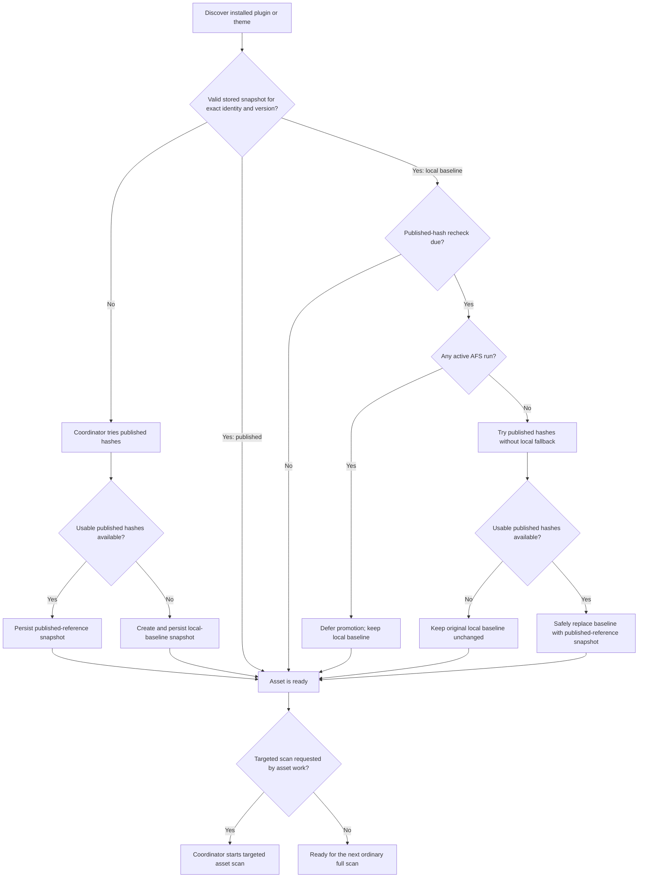
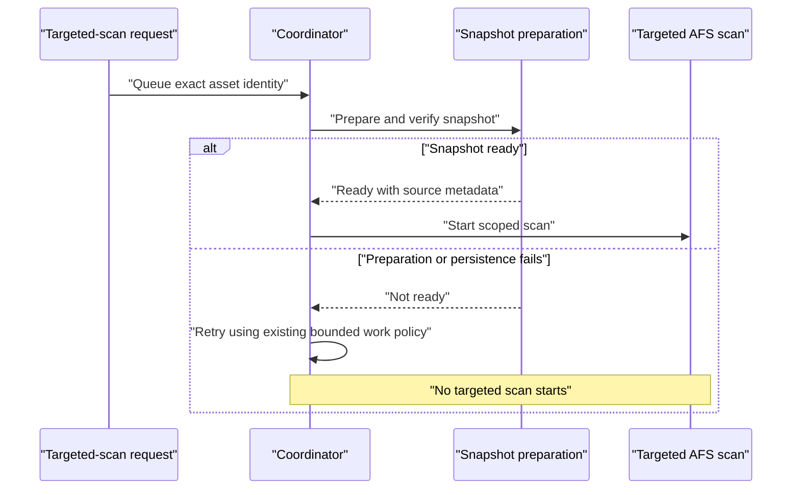

# AFS Inactive Asset Snapshot Lifecycle

**Status:** Aligned behavioural specification  
**Date:** 2026-07-24  
**Last aligned:** 2026-08-04  
**Review surface:** This specification, the six [`docs/handovers/afs-inactive-asset-snapshot-lifecycle`](handovers/afs-inactive-asset-snapshot-lifecycle) prompts, and [`CONTEXT.md`](../CONTEXT.md) for terminology only  
**Scope:** AFS file-change comparison and malware scanning for installed WordPress plugins and themes, including inactive assets

## 1. Purpose

This specification defines the smallest complete lifecycle needed to prevent AFS scans from failing when an installed plugin or theme has no usable hashes.

The intended outcome is:

- inactive plugins and themes are prepared for file-change comparison, not ignored;
- the coordinator remains responsible for preparing snapshots before coordinator-started asset scans;
- an unavailable published hash set does not make an installed asset permanently unscannable;
- malware scanning, when already licensed and enabled, continues independently of the source of file-change hashes;
- a full scan does not hang or repeatedly fail because one asset is unprepared;
- local baselines are upgraded to published hashes when published hashes later become available;
- scan results never claim more coverage than the scan actually performed; and
- the implementation does not introduce a new user-facing workflow or a general-purpose state machine.

This is a behavioural specification, not an implementation plan. Code locations are included only to anchor the specification in the current system.

## 2. Decision status

All alignment decisions in [Section 15](#15-alignment-decisions) are confirmed. **Required** identifies target behaviour and **out of scope** identifies behaviour deliberately excluded from this change.

## 3. Terms

### 3.1 Installed asset

A plugin or theme currently present on the WordPress filesystem and discoverable by WordPress, whether active or inactive.

“Create the asset locally” in earlier discussion is interpreted as resolving and recording the installed asset identity needed by the coordinator. It does **not** mean installing, activating, or downloading a plugin or theme.

An asset identity is:

- asset type: `plugin` or `theme`;
- stable WordPress asset key, such as the plugin file or theme stylesheet; and
- installed version.

### 3.2 Snapshot

A persisted map of asset-relative file paths to hashes, together with metadata identifying the exact asset and version.

A stored snapshot belongs to the exact asset identity/version, not to an individual AFS run. It is kept in the normal snapshot store and may be reused by multiple runs while it remains valid. “Snapshot preparation” means that the coordinator ensures this shared stored snapshot exists, is non-empty, and verifies against the current asset identity/version before comparison depends on it. It does not mean creating or copying a private snapshot into the scan record.

There are two snapshot sources.

| Snapshot source | Hashes were produced from | What a mismatch means |
|---|---|---|
| Published-reference snapshot | A supported hashes API for the exact asset and version | The current file differs from the published/reference package |
| Local-baseline snapshot | The installed files at the time Shield first created the baseline | The current file differs from the locally observed baseline |

Both sources support useful file-change comparison. They do not make the same historical claim.

### 3.3 Published hashes

Hashes returned by a supported hashes API for the exact installed asset version. The existing `live_hashes=true` metadata represents this source.

“Published” does not mean only WordPress.org. A premium asset may also have published hashes if the API explicitly supports it.

### 3.4 Local baseline

A snapshot created by hashing the currently installed asset files because published hashes were unavailable.

A local baseline can support these claims on later scans:

- a known file has changed since the baseline;
- a file not present in the baseline has been added since the baseline; and
- a previously reported difference is no longer present relative to the same baseline.

It cannot establish whether the asset was already modified before the baseline was created.

### 3.5 File-change comparison

Comparison of a current file against an exact-version preflight scan hash cache reference or the applicable published-reference or local-baseline stored-snapshot fallback.

This specification avoids using the unqualified word “integrity” because it hides the material difference between a published-package comparison and a since-baseline comparison.

### 3.6 Malware scan

Premium-gated content and signature analysis that is independent of file-change comparison.

Throughout this specification, “malware scanning continues” and “remains eligible for malware scanning” mean only that snapshot availability, source, or comparison coverage MUST NOT introduce an additional reason to skip or abort malware scanning. All existing premium entitlement, feature enablement, scan configuration, and other malware-scan gates remain authoritative and unchanged. This specification MUST NOT enable malware scanning when those gates do not permit it.

A matching local baseline must never be treated as proof that a file is malware-free.

### 3.7 Targeted asset scan

An AFS run scoped to one plugin or one theme and started after the coordinator confirms that a usable shared stored snapshot exists for the asset’s exact identity and version.

### 3.7.1 Asset follow-up scan

A deduplicated targeted asset scan enqueued by the coordinator to complete or recompute comparison for an exact asset/version after an asset lifecycle event, a full-scan concurrency exception, or successful snapshot promotion. It runs through the normal scan queue after its exact-version snapshot has been prepared. Routine reconciliation alone does not request one.

### 3.8 Ordinary full scan

An AFS run whose file population may include WordPress core, all plugin directories, all theme directories, and other configured scan areas.

### 3.9 Snapshot readiness cutoff

The moment an ordinary full scan captures the installed plugin/theme set for its readiness preflight. Assets in that captured set are part of the normal snapshot-readiness guarantee. Assets installed or changed after this point belong to the concurrency exception.

### 3.10 AFS run

One execution of AFS represented and completed as one scan. An ordinary full scan and a targeted asset scan are separate AFS runs.

### 3.11 Active AFS run

An AFS run whose scan record is `queued`, `building`, `built`, or `running`.

### 3.12 Asset comparison coverage

Whether one AFS run completed file-change comparison for an exact plugin or theme identity and version. Malware coverage is independent and may still be complete when asset comparison coverage is incomplete.

An asset known to be comparison-ineligible before its files are processed has no file-change finding effect in that run. A different, deliberately simpler rule applies to the rare case where an asset changes after the run has already persisted observations: those earlier observations are not rolled back, later unsafe comparisons stop, stale resolution is blocked for the affected asset, and one targeted follow-up is queued to establish the current state.

### 3.13 File population

The complete set of file paths frozen when an AFS run is built. Files added after this set is frozen do not belong to that run.

### 3.14 Queue batch

A bounded subset of an AFS run's file population processed as one queue unit. A queue batch is not an AFS run, targeted asset scan, finding, or user-visible completion boundary.

### 3.15 File-change observation

The outcome of comparing one file during the current AFS run. For an asset known to be ineligible before processing, no file-change observation is produced. In the rare mid-execution race, observations persisted before the mismatch is detected may remain provisional until the follow-up scan establishes the current result.

### 3.16 Finding

A persisted, currently relevant issue reported by scanning. A finding retained from an earlier completed run is distinct from a file-change observation produced by the current run.

### 3.17 Terminology guardrails

The following interpretations are explicitly incorrect:

1. “Hashes unavailable” does **not** mean the asset is excluded from AFS or, when the existing malware-scan gates permit it, malware scanning.
2. “Asset comparison coverage is incomplete” does **not** mean earlier unresolved findings may be cleared.
3. “Disregard the current comparison” does **not** mean discard malware results, findings retained from earlier completed runs, or observations already persisted before a rare mid-execution mismatch.
4. “Asset follow-up scan” means a separate targeted AFS run enqueued through the normal scan queue; it does not mean retrying a failed queue batch.
5. “Queue batch” does **not** mean “asset scan.” A queue batch may be an arbitrary subset of files unless an explicitly adopted design gives it asset ownership.
6. “Security Alert” is not a sufficiently precise domain term. The current email subject is used for a scheduled scan-result report, while the Instant Alerts subsystem also sends independent event-driven alerts.

### 3.18 Scan-result notification

An automated report or alert whose user-facing content is derived from persisted scan findings. This includes the scheduled report email currently labelled “Security Alert,” the scan-results section of the scheduled “Security Report,” and the vulnerability alert produced after scan-queue completion.

### 3.19 Non-scan instant alert

An event-driven user notification whose content is not derived from AFS, APC, or WPV scan-result records. Current examples are admin login, admin-account changes, firewall blocks, Shield deactivation, FileLocker changes, and cloaked-plugin detection.

### 3.20 Scan audit event

An activity-log record describing scan execution or observations, including `scan_run` and `scan_items_found`. A scan audit event is historical evidence, not a scan-result email and not an Instant Alert.

### 3.21 Notification-ready scan state

The state in which no scan record is `queued`, `building`, `built`, or `running`, and no retryable AFS asset-follow-up entry remains pending in the coordinator. An exhausted coordinator entry that has no retry scheduled does not block notification indefinitely.

### 3.22 Accepted notification-readiness race

The bounded interval after a fresh readiness check returns ready and before the automatic scan-result notification attempt completes. Another request may create an active scan or retryable AFS asset-follow-up during that interval. The in-flight notification attempt may continue; readiness is not a lock or lease held across notification processing.

## 4. Baseline behaviour and confirmed gap

The following describes the pre-implementation repository baseline as inspected on 2026-07-26. It is the behaviour that motivated this specification, not a claim that later in-flight slices remain unimplemented.

1. A full AFS inventory can include inactive plugin and theme directories because [`BuildScanItems`](../src/Scans/Afs/BuildScanItems.php) inventories the configured plugin and theme roots rather than only active assets.
2. Routine snapshot discovery is active-only because [`FindAssetsToSnap`](../src/Modules/HackGuard/Lib/Snapshots/FindAssetsToSnap.php) returns active plugins, the active theme, and its parent when applicable.
3. The coordinator already enforces a hard preparation gate for its own targeted asset scans. [`Cleanup::process()`](../src/Modules/HackGuard/Scan/AssetChange/Cleanup.php) prepares and verifies hashes before calling `startAfsAssetScan()`. If preparation fails, that targeted scan does not start.
4. The hard preparation gate does not currently govern ordinary full AFS scans.
5. [`Retrieve::byVOWithSource()`](../src/Modules/HackGuard/Lib/Hashes/Retrieve.php) currently tries the remote source before the stored snapshot and throws `AssetHashesNotFound` if neither supplies hashes.
6. Plugin/theme file-change checks run before malware analysis in [`FileScanner`](../src/Scans/Afs/FileScanner.php). An unavailable hash set can therefore escape before malware analysis is reached.
7. [`ScheduleBuildAll::getAssetsThatNeedBuilt()`](../src/Modules/HackGuard/Lib/Snapshots/StoreAction/ScheduleBuildAll.php) treats any verified snapshot as complete. It does not revisit a local baseline merely because published hashes may now exist.
8. Snapshot relevance is time-based. [`Store`](../src/Modules/HackGuard/Lib/Snapshots/Store.php), [`TouchAll`](../src/Modules/HackGuard/Lib/Snapshots/StoreAction/TouchAll.php), and [`CleanStale`](../src/Modules/HackGuard/Lib/Snapshots/StoreAction/CleanStale.php) together mean inactive snapshots can age out while inactive assets remain installed, because the active-only inventory does not touch them.
9. An ordinary full scan does not currently obtain an all-installed-asset readiness guarantee from the coordinator before freezing its items.

The confirmed defect is therefore not simply “inactive assets are scanned.” The defect is that snapshot preparation and snapshot retention cover a narrower asset set than ordinary AFS inventory, while a missing snapshot can abort file processing before malware analysis.

## 5. Required invariants

These invariants apply to the target behaviour.

### 5.1 Coordinator ownership

1. The coordinator MUST own snapshot acquisition, local-baseline creation, snapshot promotion, and the ordering of targeted asset scans.
2. Per-file scan code MUST NOT contact a remote hashes service, build a snapshot, replace a snapshot, or wait for snapshot preparation.
3. A coordinator-started targeted plugin/theme scan MUST NOT start until a non-empty snapshot for that exact asset identity and version has been persisted and verified.
4. Failure to prepare a snapshot MUST be a coordinator work failure, not a partially started targeted scan.
5. For the installed plugin/theme set captured at an ordinary full scan’s snapshot readiness cutoff, the main-network coordinator owner MUST attempt to prepare every asset before comparison eligibility and scan items are frozen. If a full scan is built on a subnetwork, it MUST NOT mutate shared snapshots; it freezes eligibility from existing usable shared snapshots only.
6. Comparison eligibility MUST be granted only to assets whose exact-version snapshots were persisted and verified.
7. Comparison eligibility for each exact asset/version MUST remain fixed for that AFS run. A snapshot created after the cutoff MUST NOT enable comparison only for later queue batches of the same run.
8. An ordinary full scan MUST NOT wait through asynchronous coordinator retries at that gate. It performs one synchronous readiness pass, freezes eligibility from the usable stored snapshots that exist after that pass, and proceeds. The main-network pass may prepare; the subnetwork pass is read-only.

The [8 October 2026 scan-hash cache extension](plans/Crowd-sourced%20hashes%20in%20AFS%20scans%20plan.md) adds crowd-sourced acquisition during scan preflight only, as described in section 8. It preserves invariant 5.1.2: file processing never contacts a remote hashes service or mutates snapshots.

### 5.2 Installed asset coverage

1. Routine discovery MUST include all installed plugins and themes, active and inactive.
2. Discovery MUST use the same asset identity rules used by file classification and targeted scan scoping.
3. Snapshot retention/touching MUST cover the same installed-asset set so an inactive asset does not repeatedly lose and rebuild its snapshot solely because it is inactive.
4. Assets no longer installed MUST not be kept alive by the retention process.

### 5.3 Snapshot selection

1. For an asset with no valid snapshot, preparation MUST try published hashes for the exact installed version first.
2. If a usable published hash set is unavailable, preparation MUST create a local baseline from the installed files.
3. A snapshot is ready only when its metadata matches the exact asset identity and version and its hash map is non-empty, readable, and valid under the hashes service/storage contract.
4. An empty, malformed, mismatched, or unwritable snapshot MUST be treated as unavailable.
5. A failed published-hash lookup MUST NOT erase or rebuild an existing valid local baseline.
6. A stored snapshot with absent or unknown source metadata MUST NOT be treated as a trusted published source. It may be treated conservatively as a local baseline or rebuilt through coordinator preparation.

### 5.4 Meaning and trust

1. A published-reference snapshot supports a “differs from the published/reference package” result.
2. A local-baseline snapshot supports a “changed or added since Shield created the baseline” result.
3. A local-baseline match MUST NOT suppress malware scanning when the existing malware-scan gates permit it.
4. A published-reference match may retain the existing trusted-source optimisation that suppresses redundant malware work.
5. When an asset is known to have no usable stored snapshot and its files cannot be verified from the scan hash cache before its file-change observations are persisted, the scan MUST NOT create, update, or resolve a file-change finding for that asset.

### 5.5 Scan completion

1. Completing a scan MUST NOT imply that every queued plugin/theme file received file-change comparison.
2. Existing unresolved file-change findings MUST NOT be resolved as clean for any asset/version that the scan did not actually compare.
3. Malware findings remain governed by the existing premium entitlement, feature enablement, scan configuration, and malware coverage rules and MUST NOT be coupled to snapshot availability.
4. Completion needs only the per-asset fact that file-change comparison was complete or incomplete; this specification does not require a general asset state machine.
5. For an asset that is ineligible at the readiness cutoff, the run creates, updates, and resolves no file-change findings for that exact asset/version.
6. If a post-cutoff mismatch is detected before any observation for that asset is persisted, the same no-effect rule applies.
7. If a true mid-execution mismatch is detected after earlier observations were persisted, the implementation MUST NOT add rollback, result journaling, observation staging, asset work groups, or a scan hierarchy for this fix. It MUST stop later unsafe comparisons, prevent stale resolution for the affected asset, and enqueue the targeted follow-up defined by A1.
8. Earlier observations left by that rare race are provisional. A successful follow-up establishes the current result. If follow-up work exhausts, those observations may remain until a later comparison-complete scan; this is an accepted residual risk of the simple design.

### 5.6 Notification boundary

1. An automatic scan-result notification path MUST obtain a fresh notification-ready decision before it begins building, persisting, marking findings as notified, or sending. Work created concurrently after that successful decision does not invalidate the in-flight attempt under the accepted notification-readiness race in Section 3.22.
2. Non-scan instant alerts MUST NOT be delayed by scan activity.
3. Scan audit events remain per-run historical records and MUST NOT be suppressed by the notification gate.

## 6. Target lifecycle

### 6.1 Overall flow

### 6.2 Routine reconciliation

Routine reconciliation is the normal repair mechanism, not an exceptional recovery workflow.

For every installed plugin and theme, it MUST:

1. resolve the exact current asset identity and version;
2. determine whether a valid snapshot already exists;
3. request the existing aggregate missing-snapshot reconciliation pass when a snapshot is missing or invalid;
4. preserve/touch valid snapshots for installed inactive assets;
5. identify local baselines whose published-hash recheck is due; and
6. stop touching snapshots for assets or versions that are no longer installed and leave them to the existing time-based stale cleanup.

The reconciliation pass SHOULD remain lightweight. Network access and directory hashing belong in coordinator work, not in discovery itself or in the request that merely noticed missing work.

This fix does not add per-run snapshot references or an active-scan retention protocol. The current installed exact version is touched before stale cleanup; obsolete asset/version snapshots simply age out under the existing policy.

Successful preparation requested only by routine reconciliation MUST stop after the snapshot is persisted and verified. It MUST NOT create a targeted scan. Main-network preparation performed synchronously by an ordinary full scan’s preflight belongs to that existing scan flow; it does not create an additional targeted scan.

### 6.3 Preparation for a missing snapshot

For one exact asset identity and version:

1. Try to acquire published hashes.
2. Validate that the response is usable, non-empty, and belongs to the exact requested asset/version.
3. If usable, persist a published-reference snapshot.
4. If unavailable for any reason, hash the installed asset and persist a local-baseline snapshot.
5. Reload and verify the stored result.
6. Reset request-local hash and asset-resolution memoization when the stored snapshot changed.
7. If separate asset work requested a targeted scan, only then may the coordinator start it. Routine reconciliation alone does not request one.

“Unavailable” includes:

- a fake or unpublished version;
- a WordPress.org version for which the service has no hashes;
- an unsupported premium plugin or theme;
- an unsupported child theme;
- a supported service returning no usable data; and
- a temporary API failure.

A temporary API failure can therefore cause an initial local baseline to be created. The later promotion flow is what recovers the stronger published-package comparison if the service becomes available.

### 6.4 Targeted asset scan

The coordinator-started targeted flow is a hard prerequisite chain:

This flow applies only when an asset event, race follow-up, successful promotion under confirmed A5, or another explicit asset workflow requested a targeted scan. Routine reconciliation uses the same preparation capability but stops after verification.

Activation state does not alter this flow. An inactive asset is still an installed asset.

### 6.5 Ordinary full scan

An ordinary full scan does not route each asset through a separate targeted scan. It does, however, have a normal snapshot-readiness gate:

1. capture the installed plugin/theme identity and version set at the readiness cutoff;
2. on the main-network owner, ask the coordinator to prepare any missing or invalid exact-version snapshots; on a subnetwork, perform no snapshot mutation and inspect existing shared snapshots only;
3. perform one synchronous readiness pass without waiting for asynchronous coordinator retries—the main-network owner may prepare, while a subnetwork only reads existing shared snapshots;
4. mark each asset comparison-eligible only when its exact-version snapshot was persisted, reloaded, and verified with non-empty readable hashes;
5. freeze one compact `asset_snapshot_eligibility` record for every captured canonical asset, containing only its exact version and whether it was comparison-eligible at the cutoff;
6. mark any asset that still lacks a usable snapshot as comparison-incomplete for this run; and
7. then build and process the full-scan items.

Keeping captured-but-unprepared entries with `comparison_eligible=false` is required. An absent canonical identity then unambiguously means the asset was not in the cutoff inventory; absence MUST NOT also mean “captured but preparation failed.” Initial ineligibility alone does not request a follow-up, but a later version mismatch still follows A1.

This is the normal guarantee. Preparation failure does not fail or hang the full scan: files belonging to an unprepared asset remain eligible for malware scanning, but the run creates, updates, and resolves no file-change findings for that exact asset/version. Routine reconciliation may prepare the snapshot later, but under confirmed A4 it does not create a targeted scan merely because preparation later succeeds.

There is still an unavoidable concurrency window:

- an asset may be installed or updated after the readiness cutoff but before or during full-scan item creation;
- an asset version may change after scan items have been frozen; or
- a snapshot may become unreadable after the scan begins.

The full scan MUST continue rather than fail the whole queue because of one such asset.

**Confirmed decision A1:** The in-flight full scan is neither cancelled nor rebuilt. The coordinator enqueues one deduplicated asset follow-up scan through the normal queue. Files from the affected asset that the original scan can still process remain eligible for malware scanning, but receive no further file-change comparison when hashes for their current asset version are unavailable. Hash unavailability for those files MUST NOT fail the queue item. After exact-version snapshot preparation, the asset follow-up scan performs the complete current-version comparison.

If the mismatch is detected after the original run already persisted observations for that asset, those earlier observations are not rolled back. Completion MUST avoid stale resolution for the affected asset, and the successful targeted follow-up establishes the current result. If the follow-up exhausts, provisional observations may remain until a later comparison-complete scan.

For the scope of this specification, an ordinary full scan remains one AFS run. The file population may be divided into internal queue batches, but those batches are not separate scans and do not independently complete or notify the user. A8 permits asset-aware work groups as a future refinement but explicitly excludes them from this fix.

### 6.6 Per-asset comparison outcome

**Confirmed decision A2:** Completion needs to know whether file-change comparison completed for each exact plugin/theme identity and version represented by the scan. If hashes are unavailable, become unavailable, or no longer match the asset version, comparison coverage for that asset is incomplete.

Incomplete asset comparison coverage means:

1. the scan makes no complete file-change claim for that asset;
2. an asset known to be incomplete before its observations are persisted creates, updates, and resolves no file-change findings;
3. a runtime mismatch detected after earlier persistence stops later observations and stale resolution but does not roll back the earlier observations;
4. findings retained from earlier completed runs are not resolved by the incomplete run;
5. malware scanning and malware findings remain independently valid; and
6. a later scan with complete comparison coverage establishes the next file-change state—an asset follow-up scan where one was explicitly requested, otherwise the next requested ordinary scan.

This is a narrow coverage fact, not a receipt, rollback journal, snapshot manifest, or general asset state machine. The frozen `asset_snapshot_eligibility` record remains immutable. The rare runtime path may add the canonical asset key to one compact persisted `asset_comparison_incomplete` set so later batches and completion stop unsafe comparison and stale resolution. No other per-asset lifecycle state is required.

### 6.7 Asset change after item creation

If the asset identity or version seen while processing a queued file differs from the scan’s eligible identity/version:

1. the old snapshot MUST NOT be used against the new version;
2. the file follows the confirmed A1 policy;
3. the coordinator MUST receive work for the new identity/version; and
4. the resulting targeted scan closes the file-change comparison gap.

Files added after the full scan’s filesystem inventory is frozen are not part of that full scan. WordPress install/update events already observed by the coordinator MUST use its existing canonical lifecycle hook path to enqueue the targeted follow-up. A manual filesystem change that produces no WordPress lifecycle event is owned by the next requested ordinary scan; this fix does not add filesystem watchers or polling.

## 7. Local-baseline promotion

### 7.1 Purpose

A local baseline is not permanently preferred over published hashes. When published hashes later become available for the same exact asset version, the stored snapshot should be promoted.

The key example is:

1. an inactive WordPress.org plugin reports a fake or not-yet-published version;
2. no API hashes exist, so Shield creates a local baseline;
3. the exact version is later published and API hashes become available; and
4. without promotion, Shield's stored-snapshot fallback would continue comparing against the local baseline forever.

### 7.2 Promotion trigger

Routine reconciliation MUST periodically reconsider snapshots marked `live_hashes=false`.

The check interval SHOULD be about once per day per asset/version, using an implementation constant rather than a user setting. A lightweight snapshot metadata value such as `last_live_hash_check_at` is sufficient to avoid querying the API on every request or scan.

Promotion candidacy remains metadata-driven routine reconciliation. It does not enter targeted `assets` work before replacement succeeds. Promotion does not introduce a workflow, state machine, retry record, or user-visible cooldown state. Every completed check—including an unavailable, unusable, or failed remote response—preserves the local baseline, creates no scan, and attempts to update only the last-check metadata. If that metadata write itself fails, log the operational failure and let a later normal reconciliation reconsider the candidate; do not create immediate retry state.

### 7.3 Promotion attempt

A promotion attempt MUST:

1. query only for published hashes for the exact existing asset identity and version;
2. avoid the normal “published then local fallback” builder, because local fallback would recreate the baseline and erase its history;
3. preserve the existing baseline hash data, source, and original creation metadata if lookup fails or returns unusable data;
4. attempt to update only the last-check metadata for any completed unsuccessful check, including a transport/API failure or unusable response; a failure to persist that timestamp is logged but creates no immediate retry state; and
5. safely publish the replacement only after the complete new hash map and metadata have been validated.

### 7.4 Promotion and active scans

Snapshot promotion MUST NOT change the stored-snapshot fallback from a local baseline to a published-reference snapshot between queue slices of the same asset in one AFS run. Successful crowd-sourced scan hash cache matches may use a published-reference basis while other files use the unchanged local-baseline fallback.

Snapshot promotion MUST NOT replace the shared stored snapshot while any AFS scan is queued, building, built, or running. The coordinator MUST leave the existing local baseline unchanged and reconsider promotion after the AFS queue becomes idle. Once promotion succeeds, the coordinator follows the confirmed A5 targeted-scan policy.

The coordinator SHOULD make this active-run check before requesting remote hashes. Deferral caused only by active AFS work is not a completed promotion check: it MUST NOT advance `last_live_hash_check_at` or create targeted `assets` work. The due metadata remains unchanged and is reconsidered through the existing scan-queue-idle/completed reconciliation trigger and normal future reconciliation.

This deliberately uses one queue-wide gate because an ordinary full scan is not partitioned into asset-owned child scans. This fix does not introduce immutable snapshot generations, per-run snapshot binding, or file-level locking.

### 7.5 After successful promotion

After promotion:

1. stored metadata MUST identify the source as published;
2. hash lookup memoization MUST be reset;
3. future scans MUST use the published-reference snapshot for stored-snapshot fallback.

**Confirmed A5:** The coordinator queues one deduplicated targeted scan for the promoted asset so existing file-change findings are promptly reevaluated using the newly available published reference.

That targeted scan can reveal both directions of change:

- a file that differed from the local baseline may match the published package; or
- a file that matched the local baseline may differ from the published package.

If the verified published replacement succeeds but persistence of the coordinator follow-up entry fails, keep the published snapshot, reset memoization, and log the operational failure. Do not restore the weaker baseline or add another retry mechanism solely for this edge. The next requested ordinary scan will use the published snapshot for stored-snapshot fallback and reconcile the findings.

## 8. Scan-time snapshot use

**Confirmed A3, extended 8 October 2026:** Plugin/theme file-change comparison first checks the preflight scan-hash cache for the file's exact asset identity/version. Only a successful cached hash match replaces stored-snapshot verification. Every cache miss, invalid file, absent path or nonmatching hash falls back to the usable shared stored snapshot unchanged. File processing performs no remote lookup.

The snapshot is prepared or verified in the coordinator before a targeted scan is started. For an ordinary full scan, the main-network owner may prepare before its comparison-ready population is frozen; a subnetwork only verifies existing shared snapshots. The stored snapshot remains unchanged in the normal shared store and is not embedded in the scan record.

During full-scan preflight, each comparison-eligible asset receives at most one crowd-sourced lookup using the existing client and its 10-second timeout. A budget shared across that preflight stops further requests after two consecutive request errors or 30 seconds of cumulative request time; remaining assets receive snapshot copies. A successful empty response resets the consecutive-error count. In-flight requests finish under the existing timeout, and a later preflight gets a fresh budget even in the same WP-CLI process. Plugin/theme-scoped preflight fills only the coordinator-prepared asset at its installed version without building or touching its snapshot; core-scoped preflight fills none. Preflight writes a normalized map of digest lists to the flat `<cache dir>/scan-hashes/` directory, one atomic JSON file per exact asset version. A non-empty crowd-sourced map has `source=crowd_sourced` and `trusted=true`. An API failure or empty response instead writes a usable stored-snapshot copy with `source=snapshot` and that snapshot's own trust; with no usable snapshot, it writes nothing. A successful empty response followed by a snapshot copy is quiet. Real request errors, write errors and missing usable snapshots are logged once per asset and never change eligibility or fail the scan. The fill requires only the existing local plugin/theme scanning capability.

Each cache filename is `<type>-<first 16 hex characters of sha1(canonical asset key)>-<sanitized version>.json`, with version characters outside `[A-Za-z0-9._-]` replaced by `_`. Metadata preserves the exact type, canonical key, installed version, source, boolean trust and creation timestamp. Readers require matching identity/version and a non-empty map of valid lowercase 32-, 40- or 64-character digest lists. They use the existing exact-path-then-lowercase lookup and `CompareFileHash` any-matching-reference comparison, computing raw digests once per algorithm and line-ending variants once per comparison. Trusted cache matches use `published_reference`; untrusted snapshot-copy matches use `local_baseline`. The existing eligibility, version mismatch and incomplete-comparison checks remain unchanged and precede lookup. Malware processing and follow-up queueing retain their existing behavior.

AFS initialization empties this separate directory before fetching, unless another AFS record is queued, building, built or running. Queue completion deletes it when no scans are active. A separate hourly listener deletes it when no AFS scan is active, including abandoned scans. Fill and directory cleanup run only on the main site of the main network. Batches memoize each asset's cache read for the PHP request and never fetch, write or delete cache files. There are no subdirectories, retries or age-based sweeps, and malware-pattern and optimiser directories are unaffected.

Successful writes, initialization, cleanup and the existing resolver memo resets clear the scan-cache memo, including between scans in a long-lived WP-CLI process. A failed hourly active-scan query preserves the directory and does not interrupt later hourly jobs.

This moves source choice to the coordinator and makes scan behaviour deterministic:

- the coordinator acquires and promotes;
- the scan compares;
- the malware scanner analyses content; and
- the completion path resolves only what was covered.

`Retrieve::byVOWithSource()` retains its crowd-sourced-first behavior for results-table rechecks and repair helpers. Removing its premium-plan gate keeps rechecks and scans consistent on plans that already scan plugins/themes; batches use `verifyScanContext()` and its stored-snapshot fallback instead of this remote-first path.

## 9. Result meaning and user communication

### 9.1 Result semantics

| Comparison basis | Allowed file-change claim | Malware behaviour |
|---|---|---|
| Published-reference snapshot | Current file differs from the published/reference hash or is not represented in that hash set | Existing trusted-source optimisation may apply to matching files |
| Local-baseline snapshot | File changed or was added after Shield created the baseline | Snapshot trust does not suppress malware scanning; all existing malware gates still apply |
| No applicable snapshot | No file-change claim | Malware remains eligible in an ordinary full scan; a targeted follow-up occurs only when explicit asset work requested it |

The stored result needs enough source context to preserve this meaning when displayed or processed later. Reusing existing snapshot/source metadata is preferred over creating a new finding type.

The target contract is one field in the existing scan-result metadata: `comparison_basis`, with either `published_reference` or `local_baseline` as its value for plugin/theme file-change findings. It MUST describe the reference actually used to produce that finding. It MUST NOT be inferred later from the asset's current snapshot because promotion may have changed the stored snapshot after the finding was created. The scan cache only contributes passing comparisons; findings still come from the unchanged stored-snapshot fallback.

The current implementation does not yet persist this complete contract. It records `live_hashes` on snapshot metadata and carries `trustedSource` during request-local hash verification, but plugin/theme file-change results currently persist asset identity, version, and finding flags without the comparison source. The existing scan-result metadata storage can carry `comparison_basis`; this does not require a new database table, finding type, or user-visible state.

### 9.2 No routine alarm for internal preparation

This work MUST NOT add a normal-path warning such as:

> Three plugins were malware-scanned while Shield created baselines.

Snapshot preparation is an internal prerequisite and recovery lifecycle. A rare race should not become routine user-facing noise.

### 9.3 No unsupported “clean” claim

The UI and audit trail MUST NOT imply a file-change clean result for an asset that received only malware coverage.

Under confirmed A6, existing result copy MUST respect `comparison_basis`: only `published_reference` supports a published-package claim, while `local_baseline` supports only a since-baseline claim. This does not introduce a new warning, dashboard state, or finding type.

### 9.4 Notification boundary

**Confirmed decision A9:** Automated scan-result notifications MUST wait until the system is in a notification-ready scan state. This normally allows an asset follow-up scan to establish the current result before scan-derived information is sent. If follow-up work exhausts, notification may resume with the accepted provisional-result limitation in A1 and A10.

The gate applies to:

1. the automatic alert report (`REPORT_TYPE_ALERT`), whose email subject is currently “Security Alert” and whose payload is the `scans/scan_results` report area;
2. the automatic information report (`REPORT_TYPE_INFO`), whose email subject is currently “Security Report,” because that report includes the latest scan-results section alongside its other areas;
3. the vulnerability Instant Alert, because its content is derived from WPV scan findings; its existing `shield/scan_queue_completed` trigger remains necessary, but the notification-readiness guard must also account for pending AFS asset-follow-up work; and
4. any future automatic email, digest, or Instant Alert that reads scan-result records to describe scan findings.

The gate does **not** apply to:

1. “Admin Login Detected”;
2. “Admin Changes Detected”;
3. “Firewall Block Detected”;
4. “Shield Deactivated”;
5. “FileLocker Changes Detected”;
6. “Cloaked Plugin Detected,” which is produced by the separate raw-plugin-visibility check rather than AFS scan-result records;
7. an explicitly requested manual/custom report; or
8. scan audit events such as `scan_run` and `scan_items_found`.

The gate MUST be checked before an automatic scan-containing report is built, stored, marked as notified, or emailed. Merely suppressing the final email is incorrect because the current alert-report path marks finding records as notified before sending.

The readiness decision is a fresh point-in-time check immediately before the notification path begins those protected side effects; it is not a lock or lease held throughout notification processing. Another request may very rarely create an active scan or retryable AFS asset-follow-up after the check returns ready and before the current notification attempt completes. The current attempt may continue from its accepted readiness decision, potentially using the previously settled findings while the new work begins. This bounded concurrency risk is explicitly accepted. The new scan or follow-up continues normally and its results establish the newer persisted state; any notification already produced by the overlapping attempt is not retracted.

Do not introduce locks, transactions, leases, repeated checks between notification side effects, persisted readiness state, or broader coordination to eliminate this accepted race. This acceptance applies only to work that appears after a successful fresh readiness check; it does not permit cached readiness or any notification side effect when the check returns not ready or fails.

For this rule, pending AFS asset-follow-up work means a coordinator entry for a specific core, plugin, or theme identity that:

- is intended to prepare that identity and then start a targeted AFS run;
- has not succeeded;
- has retry attempts remaining; and
- has a future or currently due execution time.

Routine missing-snapshot discovery, unrelated WPV coordinator work, and exhausted entries with no retry scheduled are not AFS asset-follow-up work under this definition. Once snapshot preparation creates the targeted AFS run, the active scan record itself continues to hold the notification gate.

The existing `shield/scan_queue_completed` action proves only that no active scan record remains at that moment. It does not prove that delayed asset-follow-up work has already created its targeted scan record, so it is not sufficient by itself for AFS notification readiness.

When retryable asset-follow-up work becomes irrelevant or exhausts without creating a scan, the coordinator MUST invoke one narrow internal readiness-open action so the vulnerability notification handler can recheck the same combined readiness predicate. This closes the trigger gap without adding a general notification workflow.

When the gate later opens, the existing scheduled reporting process may generate the report. The vulnerability handler may re-enter through the narrow readiness-open action above. This specification does not introduce a new immediate-report dispatch path for scheduled reports.

If follow-up work exhausts after the rare mid-execution race described in A1, the gate opens even though provisional earlier observations may remain. Those observations are an accepted residual risk of the simple no-rollback design; they are corrected by the next comparison-complete scan.

## 10. Edge-case behaviour

Snapshot preparation in this table does not itself request a scan. Unless the row identifies explicit asset-follow-up work, routine reconciliation prepares the asset for a future ordinary full scan and stops.

| Scenario | Snapshot action | Scan action | Result/lifecycle requirement |
|---|---|---|---|
| Inactive WordPress.org plugin/theme; exact hashes available | Build published-reference snapshot | No scan from reconciliation alone | Published-package comparison is available to the next requested scan |
| Inactive WordPress.org asset; fake or unpublished version | Build local baseline | No scan from reconciliation alone | Since-baseline comparison is available to the next requested scan; otherwise-enabled malware coverage remains independent |
| Premium asset supported by hashes API | Build published-reference snapshot | No scan from reconciliation alone | Published-package comparison is available to the next requested scan |
| Premium or custom asset with no supported hashes | Build local baseline | No scan from reconciliation alone | Since-baseline comparison is available to the next requested scan; otherwise-enabled malware coverage remains independent |
| Child theme with no published-hash support | Build local baseline | No scan from reconciliation alone | Since-baseline comparison is available to the next requested scan; otherwise-enabled malware coverage remains independent |
| API temporarily fails and no snapshot exists | Build local baseline | No scan from reconciliation alone | Later promotion rechecks published source |
| API temporarily fails and a local baseline exists | Preserve baseline | Existing baseline remains usable | Do not reset change history |
| API returns empty, malformed, or wrong-version data | Reject response | Preserve existing valid snapshot or build baseline if none exists | Never publish unusable reference data |
| Snapshot files cannot be persisted or reloaded | Asset remains unprepared | Existing targeted work uses bounded retries and does not start its scan; a main-network full scan makes one synchronous preparation attempt and proceeds | No file-change finding effect for that exact asset/version; otherwise-enabled malware coverage remains independent |
| Local hashing returns no files/hashes | Asset remains unprepared | Targeted scan does not start; a main-network full scan proceeds after its one synchronous preparation attempt | Treat as preparation failure without failing the full scan |
| Asset appears after the readiness cutoff but before full-scan item freeze | Enqueue one deduplicated asset follow-up scan | Process any frozen files safely under the existing malware gates; do not fail the original scan | Suppress file-change effects if detected before persistence; otherwise stop later unsafe comparison, preserve old findings, and let the follow-up establish the current result |
| Asset appears after full-scan item freeze through a supported WordPress install/update event | Existing canonical lifecycle hook enqueues one deduplicated asset follow-up scan | Leave the original scan unchanged | Asset follow-up owns comparison and otherwise-enabled malware coverage for the new files |
| Asset appears only through a manual filesystem change after item freeze | No new watcher or polling | Leave the original scan unchanged | The next requested ordinary scan owns it |
| Asset version changes after item freeze | Enqueue one deduplicated asset follow-up scan for the new version | Never compare new files to the old-version snapshot; continue safely under the existing malware gates | Do not roll back earlier observations; stop later unsafe comparison and stale resolution; the follow-up establishes the current result |
| Promotion becomes due while any AFS scan is queued, building, built, or running | Preserve the existing local baseline and defer promotion until the AFS queue is idle | Do not start the promotion follow-up until promotion succeeds | No promotion-induced change to the stored-snapshot fallback basis and no snapshot generations |
| Published promotion succeeds but its follow-up entry cannot be persisted | Keep the verified published snapshot and log | No new retry mechanism; next requested ordinary scan uses the published snapshot for stored-snapshot fallback | Existing findings retain their recorded comparison basis until that scan |
| Asset is deleted before queued preparation runs | Do not rebuild | Drop asset work as successfully irrelevant | Stale snapshot becomes cleanup-eligible |
| Queued file is deleted before processing | Do not manufacture a plugin/theme missing-file claim | Continue queue safely | Existing findings resolve only if coverage rules permit |
| Local baseline was created from already-infected files | Preserve baseline meaning only | Malware scanning remains eligible under its existing gates | Baseline match never suppresses malware |
| Root/single-file plugin | Build one-file snapshot using plugin file identity | Scoped scan uses explicit file | Same source and completion rules |
| Multiple plugin headers share one directory | Use the scanner’s canonical identity resolver | If identity is ambiguous, make no file-change claim | Malware remains eligible; log diagnostic evidence |
| Multisite installation | Main-network coordinator owns shared filesystem preparation | Avoid duplicate network work | Same installed asset/version is prepared once |
| Snapshot source metadata is absent or unknown | Treat as untrusted and promotion/rebuild-eligible | Do not suppress malware from that source | Never infer a published-package claim |

### 10.1 Deleted files

This specification does not introduce plugin/theme deleted-file detection.

The current plugin/theme inventory is driven primarily by files present on disk. A snapshot entry whose file is absent is not necessarily emitted as a queued scan item. The implementation MUST NOT claim deleted-file coverage unless a separate, tested inventory comparison is added.

WordPress core missing-file behaviour is separate and unchanged.

### 10.2 Ambiguous plugin directories

The current resolver associates a plugin directory with an installed plugin file found in that directory. Multiple independently versioned plugin headers in one directory can therefore be ambiguous.

This change must fail conservatively:

- no comparison against a guessed asset/version;
- no scan failure solely because classification is ambiguous; and
- no redesign of WordPress plugin identity as part of this work.

## 11. Failure and retry policy

1. Reuse the coordinator’s existing bounded retry and exhausted-work logging for targeted asset work only.
2. Do not add terminal, cooldown, unavailable, degraded, or user-action-required states as part of this change.
3. An API miss is not an operational failure when a local baseline can be created.
4. Local snapshot persistence failure is an operational failure because the targeted prerequisite cannot be satisfied.
5. Repeated preparation failure must not leave a targeted scan partially created.
6. An ordinary full scan makes one synchronous readiness pass before freezing eligibility: preparation on the main-network owner, read-only verification on a subnetwork. It MUST NOT wait for or create asynchronous preparation retries and MUST NOT retry the same queue slice for `AssetHashesNotFound`.
7. Once routine reconciliation later prepares the asset, the next requested scan can restore its file-change coverage. Reconciliation alone does not create a targeted scan under confirmed A4.
8. Promotion candidates remain routine metadata-driven reconciliation, not targeted retry work. A completed unsuccessful promotion check preserves the baseline and attempts to advance `last_live_hash_check_at`. If the timestamp cannot be persisted, log the failure and let normal future reconciliation reconsider it; do not create immediate retry work.
9. Failure to persist the post-promotion follow-up entry MUST NOT undo a verified published replacement or create another retry workflow. Log it and let the next requested ordinary scan reconcile the asset.

## 12. Completion and stale-result rules

The scan completion path currently resolves old results according to scan scope and coverage families. Snapshot availability introduces a narrower fact: a scan can nominally include plugin/theme file-change coverage while omitting comparison for one asset in a race.

The target completion contract is:

1. malware coverage remains independent;
2. plugin/theme file-change coverage is evaluated from the immutable `asset_snapshot_eligibility` record plus the compact runtime `asset_comparison_incomplete` set;
3. a full scan may resolve an old file-change finding only when the corresponding asset was comparison-eligible and its comparison remained complete using exact-version scan hash cache references or the usable stored-snapshot fallback;
4. a skipped or mismatched asset leaves its old file-change findings unresolved;
5. observations persisted before a true mid-execution mismatch are not rolled back; later unsafe comparison stops and completion leaves older findings unresolved;
6. a later scan with complete comparison coverage may resolve those findings for that asset; and
7. source promotion followed by a targeted scan may resolve or replace local-baseline-relative findings according to the published reference.

This rule prevents a malware-only fallback from being misrepresented as a clean file-change rescan.

## 13. Acceptance scenarios

### 13.1 Inactive WordPress.org asset with hashes

**Given** an installed inactive plugin has no snapshot  
**And** published hashes exist for its exact version  
**When** reconciliation runs  
**Then** the coordinator persists and verifies a published-reference snapshot  
**And** any targeted scan requested for that asset runs only after verification.

### 13.2 Inactive asset without published hashes

**Given** an installed inactive plugin or theme has no snapshot  
**And** no usable published hashes exist  
**When** reconciliation runs  
**Then** the coordinator persists and verifies a local baseline  
**And** any targeted scan requested for that asset uses that baseline for stored-snapshot fallback  
**And** matching baseline hashes do not suppress malware scanning.

### 13.3 Normal full-scan readiness

**Given** installed plugins or themes have missing or invalid snapshots at the readiness cutoff  
**When** an ordinary full scan is requested on the main-network owner  
**Then** the coordinator attempts to prepare and verify snapshots for that captured asset set before comparison eligibility and scan items are frozen  
**And** only successfully prepared exact asset/versions become comparison-eligible  
**And** the scan proceeds after that one synchronous preparation pass without waiting for asynchronous retries or hanging.

On a subnetwork, the same cutoff record is frozen from existing usable shared snapshots only; no snapshot acquisition, local hashing, touching, or persistence occurs.

### 13.4 Full-scan race

**Given** an ordinary full scan has started  
**And** an asset was installed or changed after the readiness cutoff, or its applicable stored snapshot became unreadable after the scan began and the queued file could not be verified from a valid exact-version scan hash cache  
**And** that asset is represented in the scan inventory  
**When** a queued file for that asset is processed  
**Then** the queue slice and full scan do not fail solely because hashes are unavailable  
**And** if the mismatch is known before observations are persisted, no file-change finding is created, updated, or resolved for that asset  
**And** if earlier observations were already persisted, they are not rolled back, but later unsafe comparisons stop and old findings are not resolved  
**And** malware scanning remains eligible for affected files that the original scan can still process  
**And** the original scan is neither cancelled nor rebuilt  
**And** the coordinator enqueues one deduplicated asset follow-up scan  
**And** the follow-up starts only after exact-version snapshot preparation and performs the complete asset comparison  
**And** if the follow-up exhausts, any provisional earlier observations may remain until a later comparison-complete scan.

### 13.5 Mid-scan version change

**Given** a full scan captured plugin version 1.0 with a matching snapshot  
**And** the plugin becomes version 1.1 before all its items are processed  
**When** a remaining file is processed  
**Then** the version 1.0 snapshot is not used against version 1.1  
**And** version 1.0 observations already persisted are not rolled back  
**And** later unsafe comparisons and stale resolution stop for the affected asset  
**And** malware findings from the run remain valid  
**And** the coordinator prepares version 1.1 and follows with a targeted scan.

### 13.6 Local baseline later has published hashes

**Given** a valid local baseline exists for an exact asset version  
**And** published hashes later become available for that same version  
**And** no AFS scan is queued, building, built, or running  
**When** its eligible promotion check runs  
**Then** the old baseline remains intact until the published response is usable and validated  
**And** the stored snapshot is safely promoted  
**And** one deduplicated targeted scan is enqueued for the promoted asset.

### 13.7 Failed promotion lookup

**Given** a valid local baseline exists  
**When** a promotion check fails or returns no usable hashes  
**Then** the baseline data and its original creation meaning remain unchanged  
**And** Shield attempts to advance only the last-check time  
**And** failure to persist that timestamp is logged without creating immediate retry work  
**And** no targeted retry work or immediate retry is created  
**And** later scans retain the same local baseline as their stored-snapshot fallback.

### 13.8 Inactive snapshot retention

**Given** an inactive asset remains installed  
**And** its snapshot is valid  
**When** snapshot maintenance runs over time  
**Then** inactivity alone does not cause that snapshot to become stale and be deleted  
**And** the asset does not repeatedly rebuild an identical baseline.

### 13.9 Preparation persistence failure

**Given** snapshot data cannot be written or verified  
**When** the coordinator processes the asset  
**Then** the targeted scan does not start  
**And** existing bounded retry/logging applies  
**And** no new user-facing scan finding is created for the preparation failure.

### 13.10 Full-scan readiness cannot make an asset eligible

**Given** an asset captured at the ordinary full scan's readiness cutoff still has no persisted, verified exact-version snapshot after the main-network preparation pass or subnetwork read-only pass  
**When** the ordinary full scan proceeds  
**Then** its files remain eligible for malware scanning  
**And** the run creates, updates, and resolves no file-change findings for that exact asset/version  
**And** earlier file-change findings for that asset remain unchanged  
**And** routine reconciliation may prepare the snapshot later without automatically creating a targeted scan.

## 14. Verification requirements

Implementation is not complete without behavioural tests covering at least:

1. discovery includes inactive plugins and inactive themes;
2. active and inactive snapshot retention use the same installed-asset inventory;
3. routine reconciliation prepares and verifies a missing snapshot without creating a targeted scan;
4. main-network ordinary full-scan preflight prepares the asset set captured at the readiness cutoff, while subnetwork preflight mutates no shared snapshot state;
5. published hashes are preferred for a missing snapshot;
6. local baseline is created when published hashes are unavailable;
7. a separately requested targeted scan starts only after stored snapshot verification;
8. preparation failure prevents targeted scan creation;
9. per-file processing uses the validated exact-version preflight scan cache only for passing matches, otherwise the unchanged stored-snapshot verification, and performs no remote hash lookup, cache mutation, snapshot build, or snapshot replacement;
10. a local-baseline match does not suppress malware;
11. a published-reference match retains existing trusted-source behaviour;
12. ordinary full scan does not fail on the confirmed A1 race path;
13. an unsuccessful main-network preparation attempt, or a subnetwork read-only miss, follows confirmed A7 without failing the full scan or affecting that asset's file-change findings;
14. missing comparison coverage cannot resolve an old file-change result, and a true mid-execution mismatch does not require rollback of observations already persisted;
15. version mismatch prevents comparison against the old snapshot;
16. promotion failure preserves the original baseline data;
17. promotion success changes the source and enqueues one deduplicated targeted scan for the promoted asset;
18. promotion detects active AFS work before remote lookup, preserves the local baseline without consuming a retry or advancing `last_live_hash_check_at`, and may replace it only after the AFS queue is idle;
19. a failed post-promotion follow-up write keeps the verified published snapshot, logs once, and creates no new retry mechanism;
20. plugin/theme file-change findings persist `comparison_basis=published_reference` or `comparison_basis=local_baseline` according to the snapshot actually used;
21. a snapshot created after one run's comparison eligibility is frozen does not enable file-change comparison for later queue batches of that run;
22. post-cutoff mismatch suppresses file-change effects when detected before persistence, or stops later unsafe comparison and stale resolution without rolling back earlier observations when detected afterward;
23. the frozen cutoff record distinguishes a captured-but-unprepared asset from an asset absent at cutoff, so routine preparation failure does not enqueue a race follow-up;
24. every automatic scan-result notification path obtains a fresh notification-ready decision before its protected side effects begin, with only the accepted post-check concurrency race in Section 3.22, while non-scan instant alerts and scan audit events remain ungated;
25. readiness is rechecked when relevant asset-follow-up work becomes irrelevant or exhausted without creating a scan;
26. root/single-file plugin preparation and scoped scanning;
27. asset deletion makes queued work irrelevant without repeated failure; and
28. routine reconciliation discovery and all snapshot mutation run only through the intended main-network owner; subnetwork full-scan inventory/readiness is read-only.

Tests should assert behaviour and persisted contracts, not UI strings or documentation text.

## 15. Alignment decisions

All decisions in this section are confirmed and form part of the target behaviour.

### A1. Files in the rare full-scan race

**Confirmed:** Do not cancel or rebuild the in-flight full scan. Enqueue one deduplicated asset follow-up scan through the normal queue. If the original scan processes affected files while exact-version hashes are unavailable, stop later unsafe file-change comparison, preserve otherwise-enabled malware scanning, and do not fail the queue item. If the mismatch is detected before observations are persisted, the affected asset has no file-change effect from that run. If it is detected after earlier observations were persisted, do not roll them back; prevent stale resolution and let the snapshot-backed asset follow-up establish the current result. If that follow-up exhausts, provisional earlier observations may remain until a later comparison-complete scan.

### A2. Per-asset comparison outcome

**Confirmed:** Persist one immutable compact `asset_snapshot_eligibility` record containing every captured canonical asset’s exact version and initial comparison eligibility. A captured entry with `comparison_eligible=false` is distinct from an identity absent at cutoff. For the rare runtime mismatch, persist only a compact `asset_comparison_incomplete` set of affected canonical asset keys; do not mutate the cutoff record. Completion treats either initial ineligibility or runtime exclusion as incomplete comparison and cannot resolve that asset’s existing file-change findings. No general comparison receipt or asset state machine is required.

### A3. Stored snapshot fallback and preflight scan references

**Confirmed, extended 8 October 2026:** Remote acquisition occurs only during preparation, promotion or scan preflight. File processing checks validated exact-version references in `scan-hashes/` and accepts any matching cached digest, otherwise it uses the unchanged stored-snapshot verification. It does not request remote hashes, mutate the scan cache, build a snapshot or replace a snapshot. The shared snapshot remains owned by the existing store; a temporary snapshot fallback copy may be written to the separate scan cache during preflight, never into the scan record. See section 8 for trust, cleanup and multisite boundaries.

### A4. Targeted scan after first baseline creation

**Confirmed:** Routine background reconciliation creates and verifies the missing snapshot, then stops. It does not enqueue a targeted scan. A targeted scan is created only when separate asset work requests one, such as an installation/update event, the confirmed A1 race follow-up, or successful promotion under confirmed A5. Main-network preparation performed inside an ordinary full scan’s readiness pass continues that existing scan flow without creating an additional targeted scan.

### A5. Promotion schedule and follow-up

**Confirmed:** Recheck each local baseline for published hashes about once per day, controlled by an implementation constant and a lightweight last-check timestamp. Every completed failed, unavailable, or unusable response preserves the baseline, creates neither a scan nor targeted retry work, and attempts to update only the last-check time. Failure to persist that timestamp is logged and left for normal future reconciliation, without immediate retry state. A usable exact-version response is promoted only after the AFS queue is idle under A11, then one deduplicated targeted scan is enqueued for that asset. If persistence of that follow-up entry fails, keep the verified published snapshot, log once, and let the next requested ordinary scan reconcile it; do not add another retry workflow.

Use the existing coordinator work queue and per-asset deduplication only for the targeted scan created after successful promotion. Promotion candidacy and unsuccessful checks remain routine metadata-driven reconciliation, not retryable coordinator work. Do not introduce a promotion state machine, new user setting, or complex coordination workflow.

### A6. User-visible distinction

**Confirmed:** Persist one `comparison_basis` value—`published_reference` or `local_baseline`—in the existing metadata for plugin/theme file-change findings. Add no new warning, dashboard state, database table, or finding type. User-facing copy may say that a file differs from the published package only for `published_reference`; for `local_baseline`, it may say only that the file changed or appeared after Shield created the baseline. Malware results and snapshot preparation remain unchanged and receive no new routine UI.

### A7. Full-scan readiness cannot make an asset eligible

**Confirmed:** An ordinary full scan performs one synchronous readiness pass before it freezes exact-version comparison eligibility. The main-network owner may prepare snapshots; a subnetwork only loads existing shared snapshots. If an asset still lacks a persisted, reloaded, verified snapshot, the scan proceeds without waiting for asynchronous retries. Files for that asset remain eligible for otherwise-enabled malware scanning, but the run creates, updates, and resolves no file-change findings for that exact asset/version; earlier file-change findings remain unchanged. Routine reconciliation may prepare the snapshot later and, under confirmed A4, does not automatically create a targeted scan.

### A8. Internal composition of an ordinary full scan

**Confirmed:** Retain one ordinary full AFS run. Do not create a parent/child scan hierarchy or a separate child scan for every asset as part of this fix.

If finer-grained ownership is needed in future, the run may partition its file population into internal asset work groups: one per plugin, one per theme, a WordPress core group, and one or more unowned/other-file groups. Each work group may still be divided into bounded queue batches. Work groups are not child scans and do not independently complete, notify, or appear as separate top-level scan runs.

Asset work groups could provide finer-grained exact asset/version ownership without multiplying top-level scan records. They are a permitted future refinement, not an implementation requirement of this specification.

**Rejected for this fix:** A separate child AFS run for every plugin, theme, core, and other-file group. That design would require new parent/child lifecycle, progress aggregation, recovery, completion, audit, and reporting semantics.

### A9. Scan-result notification boundary

**Confirmed:** Automatic scan-result notifications wait until there are no active scan records and no retryable AFS asset-follow-up entries in the coordinator. The gate is applied before report generation, persistence, notification marking, and email sending. Scan audit events and non-scan instant alerts continue normally. When relevant asset work becomes irrelevant or exhausts without creating a scan, one narrow internal action causes the vulnerability handler to recheck readiness. Exhausted work does not hold the gate.

**Accepted concurrency limitation:** Readiness is one fresh point-in-time decision immediately before the notification path begins its protected side effects. Work created concurrently after that successful check does not cancel or restart the in-flight notification attempt. The resulting small risk of notification processing overlapping newly created scan or asset-follow-up work is accepted. Do not add locks, transactions, leases, repeated per-side-effect checks, persisted readiness state, or broader coordination to remove it. A not-ready or failed check still permits no notification side effect.

“Security Alert” MUST NOT be used unqualified in implementation documentation for this decision because it is both an existing scheduled report-email label and an easily confused description of the separate Instant Alerts subsystem. Use “scan-result notification” or “non-scan instant alert.”

### A10. Incomplete asset comparison observations

**Confirmed:** If an asset is known to be comparison-incomplete before observations are persisted, that run creates, updates, and resolves no file-change findings for it. If a true mid-execution mismatch is detected after earlier observations were persisted, do not roll them back: stop later unsafe comparison, prevent stale resolution for the asset, and enqueue the A1 follow-up. A successful comparison-complete scan establishes the current result. If follow-up work exhausts, provisional earlier observations may remain until a later comparison-complete scan. Otherwise-enabled malware findings remain valid throughout.

This is a behavioural requirement only. It MUST NOT introduce asset work groups, child scans, file-level lifecycle states, rollback, result journaling, or observation staging for this fix. Use the smallest mechanism that stops unsafe later work and stale resolution.

### A11. Snapshot promotion while AFS is active

**Confirmed:** Do not replace the shared stored snapshot while any AFS scan is queued, building, built, or running. Preserve the existing local baseline without advancing its last-check timestamp or creating retry work. Reconsider it through the existing queue-idle/completed reconciliation trigger and normal future reconciliation. After a later successful promotion, enqueue the targeted scan required by confirmed A5. Do not introduce immutable snapshot generations or per-run snapshot binding for this fix.

## 16. Explicit non-goals

This change does not:

- skip inactive plugins or themes merely because they are inactive;
- activate, install, repair, or download assets;
- create a perfect provenance system for pre-baseline history;
- introduce a general workflow engine;
- introduce rollback, result journaling, observation staging, or scan generations;
- add terminal/cooldown/degraded asset states;
- add a normal-path snapshot preparation notice;
- redesign plugin identity for multiple plugin headers in one directory;
- add plugin/theme deleted-file detection;
- alter WordPress core checksum or missing-file behaviour;
- make local baselines trusted for malware suppression;
- keep retrying remote hashes from inside the per-file scanner;
- introduce asset work groups or a parent/child scan hierarchy;
- redesign the Instant Alerts subsystem; or
- promise that an asset is identical to its vendor package when only a local baseline exists.

## 17. Likely implementation surface

The eventual implementation is expected to remain concentrated around:

- installed asset discovery and snapshot retention:
  - [`FindAssetsToSnap`](../src/Modules/HackGuard/Lib/Snapshots/FindAssetsToSnap.php)
  - [`TouchAll`](../src/Modules/HackGuard/Lib/Snapshots/StoreAction/TouchAll.php)
  - [`CleanStale`](../src/Modules/HackGuard/Lib/Snapshots/StoreAction/CleanStale.php)
- coordinator discovery and ordered work:
  - [`AssetCoordinator`](../src/Modules/HackGuard/Lib/AssetCoordinator/AssetCoordinator.php)
  - [`Cleanup`](../src/Modules/HackGuard/Scan/AssetChange/Cleanup.php)
- snapshot build, verification, and promotion:
  - [`Build`](../src/Modules/HackGuard/Lib/Snapshots/StoreAction/Build.php)
  - [`ScheduleBuildAll`](../src/Modules/HackGuard/Lib/Snapshots/StoreAction/ScheduleBuildAll.php)
  - [`Store`](../src/Modules/HackGuard/Lib/Snapshots/Store.php)
- scan-time retrieval and comparison:
  - [`Retrieve`](../src/Modules/HackGuard/Lib/Hashes/Retrieve.php)
  - [`AssetTrustResolver`](../src/Modules/HackGuard/Lib/Hashes/AssetTrustResolver.php)
  - [`FileScanner`](../src/Scans/Afs/FileScanner.php)
- full-scan inventory, persisted scan contract, and completion:
  - [`BuildScanItems`](../src/Scans/Afs/BuildScanItems.php)
  - [`PopulateScanItems`](../src/Modules/HackGuard/Scan/Init/PopulateScanItems.php)
  - [`Afs`](../src/Modules/HackGuard/Scan/Controller/Afs.php)
  - [`Store`](../src/Modules/HackGuard/Scan/Results/Store.php)
  - [`SetScanCompleted`](../src/Modules/HackGuard/Scan/Init/SetScanCompleted.php)
- scan-result notification readiness:
  - [`AutoReportCoordinator`](../src/Modules/Plugin/Lib/Reporting/AutoReportCoordinator.php)
  - [`AlertHandlerVulnerabilities`](../src/Components/CompCons/InstantAlerts/Handlers/AlertHandlerVulnerabilities.php)
  - [`AssetCoordinator`](../src/Modules/HackGuard/Lib/AssetCoordinator/AssetCoordinator.php)

This list is a boundary check, not permission to refactor every listed class.

## 18. Definition of done

The behaviour is complete when:

1. all installed active and inactive assets participate in reconciliation and retention;
2. every coordinator-started targeted asset scan has a verified exact-version snapshot before it starts;
3. unsupported hashes produce a durable local baseline rather than a failed scan;
4. full scans survive the post-cutoff concurrency race according to the confirmed A1 policy;
5. full scans whose one synchronous readiness pass cannot make an asset eligible preserve otherwise-enabled malware coverage and have no file-change finding effect for that exact asset/version under confirmed A7;
6. otherwise-enabled malware coverage is not lost or incorrectly suppressed, and no existing malware entitlement or enablement gate is bypassed;
7. file-change findings reflect their actual comparison basis;
8. comparison known to be incomplete before persistence has no file-change effect, while a later-detected mismatch stops unsafe comparison and stale resolution without rollback;
9. local baselines are safely promoted when published hashes later appear;
10. promotion cannot alter the source halfway through a scan;
11. inactive snapshots do not age out solely because of activation state;
12. targeted asset work reuses the coordinator’s bounded retry/logging, while ordinary full-scan readiness and promotion checks do not create new retry workflows;
13. automatic scan-result notification paths obtain a fresh notification-ready decision before beginning their protected side effects, subject only to the accepted post-check concurrency race, without delaying non-scan instant alerts; and
14. no new normal-path UI workflow or asset state machine is introduced.
