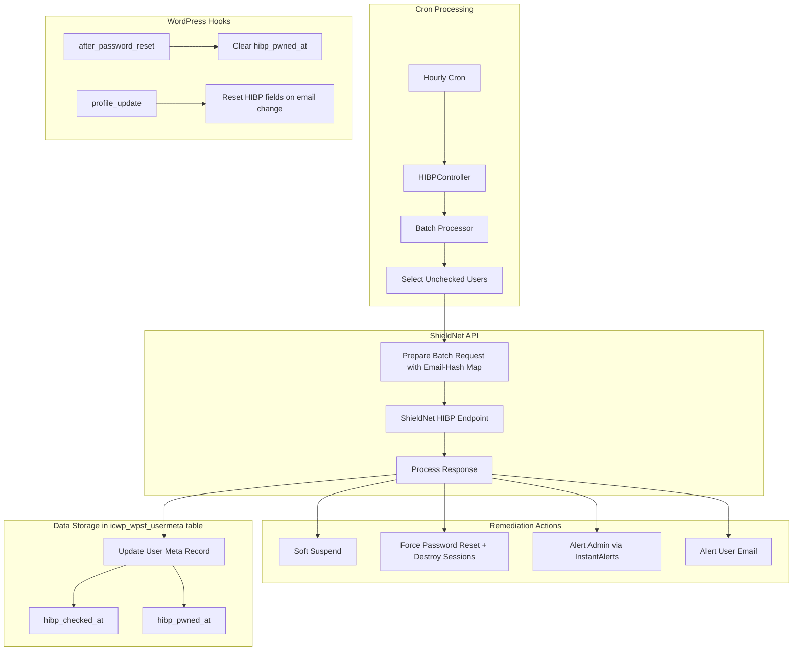

# HIBP Email Breach Checking System

## Overview

This feature queries user email addresses against HaveIBeenPwned.com via the ShieldNet API to identify accounts with compromised credentials. Based on admin configuration, the system takes remediation actions: suspend accounts, force password resets, or send alerts.

## Architecture



## Data Storage (Database Table)

HIBP timestamps are stored in the `icwp_wpsf_usermeta` database table, NOT WordPress user meta. Fields ending in `_at` are defined in `plugin.json` under `configuration.databases.user_meta.cols_timestamps`.

### Required Changes to plugin.json

**Location**: `plugin.json` line 5639-5641, after `"pass_started_at"` entry in `configuration.databases.user_meta.cols_timestamps`

Add these two new timestamp columns:

```json
            "pass_started_at":      {
              "comment": "Password First Seen or Set"
            },
            "hibp_checked_at":      {
              "comment": "Last HIBP Check"
            },
            "hibp_pwned_at":        {
              "comment": "HIBP Breach Detected At"
            }
```

**Note**: Add a comma after the existing `pass_started_at` closing brace before adding the new entries.

### Update UserMeta/Ops/Record.php

Add to the docblock properties:

```php
/**
 * @property int $hibp_checked_at
 * @property int $hibp_pwned_at
 */
```

### Update UserMeta/Ops/Common.php

Add filter methods following existing patterns:

```php
public function filterByHibpNotCheckedSince( int $since ) {
    return $this->addWhereOlderThan( $since, 'hibp_checked_at' );
}

public function filterByHibpBreached() {
    return $this->addWhereNewerThan( 0, 'hibp_pwned_at' );
}
```

### Accessing HIBP Meta (CRITICAL PATTERN)

Database-backed fields use `$meta->record->field_name`, NOT `$meta->field_name`:

```php
// CORRECT - stored in database table
$meta->record->hibp_checked_at = Services::Request()->ts();
$meta->record->hibp_pwned_at = $breachTimestamp;

// WRONG - would store in WordPress user meta
$meta->hibp_checked_at = $timestamp; // DO NOT USE
```

## ShieldNet API Endpoint

### Request (from Shield to ShieldNet)

Create [`ShieldNetApi/Hibp/CheckEmails.php`](src/lib/src/ShieldNetApi/Hibp/CheckEmails.php) extending `BaseShieldNetApiV2`:

```php
<?php declare( strict_types=1 );

namespace FernleafSystems\Wordpress\Plugin\Shield\ShieldNetApi\Hibp;

use FernleafSystems\Wordpress\Plugin\Shield\ShieldNetApi\Common\BaseShieldNetApiV2;

class CheckEmails extends BaseShieldNetApiV2 {

    public const API_ACTION = 'hibp/check';
    
    /**
     * Maintains mapping of email -> hash for response lookup.
     * CRITICAL: Hashes are one-way, so we must keep this mapping to find users from response.
     */
    private array $emailHashMap = [];
    
    /**
     * @param array $userEmails Array of email addresses
     * @param int   $oldestLastCheck Oldest hibp_checked_at timestamp from the batch
     * @return array{error_code: int, results: array}|null
     */
    public function check( array $userEmails, int $oldestLastCheck ) :?array {
        // Build email -> hash mapping for response lookup
        $this->emailHashMap = [];
        $hashedEmails = [];
        foreach ( $userEmails as $email ) {
            $hash = \hash( 'sha256', \strtolower( \trim( $email ) ) );
            $this->emailHashMap[ $email ] = $hash;
            $hashedEmails[] = $hash;
        }
        
        $this->request_method = 'post';
        $this->timeout = 120; // Extended timeout for batch requests
        $this->params_body = [
            'email_hashes'    => $hashedEmails,
            'last_checked_at' => $oldestLastCheck,
        ];
        
        return $this->sendReq();
    }
    
    /**
     * Find original email address from response hash.
     */
    public function findEmailByHash( string $hash ) :?string {
        return \array_search( $hash, $this->emailHashMap, true ) ?: null;
    }
    
    public function getEmailHashMap() :array {
        return $this->emailHashMap;
    }
}
```

### Response (from ShieldNet API)

```json
{
  "error_code": 0,
  "results": {
    "a1b2c3d4e5f6...": {
      "breached_since_last_check": true,
      "total_breaches": 5,
      "most_recent_breach_at": 1702900800
    },
    "f6e5d4c3b2a1...": {
      "breached_since_last_check": false,
      "total_breaches": 0,
      "most_recent_breach_at": 0
    }
  }
}
```

### API Error Handling

The batch processor must handle:

- `null` response (network failure)
- `error_code !== 0` (API error)
- Missing `results` key
- HTTP 429 rate limiting (backoff and retry next cron)

## Core Components

### 1. HIBP Controller

Create [`Components/CompCons/HibpBreachCon.php`](src/lib/src/Components/CompCons/HibpBreachCon.php):

```php
<?php declare( strict_types=1 );

namespace FernleafSystems\Wordpress\Plugin\Shield\Components\CompCons;

use FernleafSystems\Utilities\Logic\ExecOnce;
use FernleafSystems\Wordpress\Plugin\Shield\Crons\PluginCronsConsumer;
use FernleafSystems\Wordpress\Plugin\Shield\Modules\PluginControllerConsumer;
use FernleafSystems\Wordpress\Plugin\Shield\Modules\UserManagement\Lib\Hibp\HibpBatchProcessor;
use FernleafSystems\Wordpress\Plugin\Shield\Modules\UserManagement\Lib\Suspend;
use FernleafSystems\Wordpress\Services\Services;

class HibpBreachCon {

    use ExecOnce;
    use PluginControllerConsumer;
    use PluginCronsConsumer;
    
    protected function canRun() :bool {
        return self::con()->isPremiumActive() 
               && self::con()->comps->opts_lookup->isHibpBreachCheckEnabled();
    }
    
    protected function run() {
        $this->setupCronHooks();
        
        // Register suspend handler if suspension is the remediation action
        $action = self::con()->opts->optGet( 'hibp_breach_action' );
        if ( \in_array( $action, [ 'suspend', 'suspend_reset' ] ) ) {
            ( new Suspend\HibpBreach() )->execute();
        }
        
        // Hook into password reset to clear HIBP status
        add_action( 'after_password_reset', [ $this, 'onPasswordReset' ] );
        
        // Hook into profile update to reset HIBP fields on email change
        add_action( 'profile_update', [ $this, 'onProfileUpdate' ], 10, 3 );
    }
    
    public function runHourlyCron() {
        ( new HibpBatchProcessor() )->process();
    }
    
    /**
     * Clear HIBP breach status after password reset so user can login.
     * Checks meta->record exists since loadMetaRecord() can return null on DB failure.
     */
    public function onPasswordReset( $user ) :void {
        if ( $user instanceof \WP_User && $user->ID > 0 ) {
            $meta = self::con()->user_metas->for( $user );
            // Null check: meta->record can be null if DB insert failed during auto-creation
            if ( $meta !== null && $meta->record !== null && $meta->record->hibp_pwned_at > 0 ) {
                $meta->record->hibp_pwned_at = 0;
                self::con()->fireEvent( 'hibp_status_cleared', [
                    'audit_params' => [ 'user_login' => $user->user_login ]
                ] );
            }
        }
    }
    
    /**
     * Reset HIBP fields when user email changes.
     * Pattern from AuditTrail/Auditors/Users::captureProfileUpdate()
     */
    public function onProfileUpdate( $userID, $oldUser, $userdata = null ) :void {
        if ( !empty( $userID ) && $oldUser instanceof \WP_User ) {
            $user = Services::WpUsers()->getUserById( $userID );
            if ( $user instanceof \WP_User && $oldUser->user_email !== $user->user_email ) {
                $meta = self::con()->user_metas->for( $user );
                // Null check: meta->record can be null if DB insert failed during auto-creation
                if ( $meta !== null && $meta->record !== null ) {
                    $meta->record->hibp_checked_at = 0;
                    $meta->record->hibp_pwned_at = 0;
                }
            }
        }
    }
}
```

**Register in ComponentLoader.php** - add to `getConsMap()`:

```php
'hibp_breach' => CompCons\HibpBreachCon::class,
```

**Add to OptsLookup.php**:

```php
public function isHibpBreachCheckEnabled() :bool {
    return self::con()->opts->optIs( 'enable_hibp_breach_check', 'Y' );
}
```

### 2. Batch Processor

Create [`Modules/UserManagement/Lib/Hibp/HibpBatchProcessor.php`](src/lib/src/Modules/UserManagement/Lib/Hibp/HibpBatchProcessor.php):

**Batch Size Calculation:**

- Count total users via `Services::WpUsers()->count()`
- Target: Process all users within 30 days
- Calculate batch size: `ceil( total_users / (30 * 24) )` per hourly cron
- Minimum batch: 10 users/hour
- Maximum batch: 100 users/hour (API rate limit consideration)
- Filter: `shield/hibp/batch_size` for admin override

**Large Site Handling (10,000+ users):**

- For sites with >7,200 users (300/day target), increase batch size
- WordPress cron is unreliable - track actual time elapsed for adaptive batching
```php
<?php declare( strict_types=1 );

namespace FernleafSystems\Wordpress\Plugin\Shield\Modules\UserManagement\Lib\Hibp;

use FernleafSystems\Wordpress\Plugin\Shield\Components\CompCons\InstantAlerts\Handlers\AlertHandlerHibp;
use FernleafSystems\Wordpress\Plugin\Shield\Controller\Email\EmailVO;
use FernleafSystems\Wordpress\Plugin\Shield\DBs\UserMeta\Ops\Select;
use FernleafSystems\Wordpress\Plugin\Shield\Modules\PluginControllerConsumer;
use FernleafSystems\Wordpress\Plugin\Shield\ShieldNetApi\Hibp\CheckEmails;
use FernleafSystems\Wordpress\Services\Services;

class HibpBatchProcessor {

    use PluginControllerConsumer;

    private const RECHECK_INTERVAL = \MONTH_IN_SECONDS;
    private const MIN_BATCH = 10;
    private const MAX_BATCH = 100;
    
    /**
     * Use site-specific prefix to avoid multisite/shared hosting collisions
     */
    private function getLockKey() :string {
        return self::con()->prefix( 'hibp_processing' );
    }
    
    public function process() :void {
        // Transient lock prevents concurrent batch processing (race condition protection)
        // Uses site-specific prefix for multisite compatibility
        $lockKey = $this->getLockKey();
        if ( \get_transient( $lockKey ) ) {
            return; // Already processing
        }
        \set_transient( $lockKey, true, 5 * MINUTE_IN_SECONDS );
        
        try {
            $this->doProcess();
        } finally {
            \delete_transient( $lockKey );
        }
    }
    
    private function doProcess() :void {
        $users = $this->getUsersToCheck();
        if ( empty( $users ) ) {
            return;
        }
        
        // Filter out invalid emails to prevent API errors and incorrect hashing
        $validUsers = \array_filter( $users, fn( $u ) => \is_email( $u->user_email ) );
        if ( empty( $validUsers ) ) {
            return;
        }
        
        $apiClient = new CheckEmails();
        $response = $apiClient->check(
            \array_map( fn( $u ) => $u->user_email, $validUsers ),
            $this->getOldestLastCheck( $validUsers )
        );
        
        // Comprehensive API response validation - don't update hibp_checked_at on failure
        if ( !$this->isValidApiResponse( $response ) ) {
            // Don't update hibp_checked_at - retry next cron
            \error_log( 'Shield HIBP: API response validation failed' );
            return;
        }
        
        $ts = Services::Request()->ts();
        $breachedUsers = [];
        
        foreach ( $validUsers as $user ) {
            $meta = self::con()->user_metas->for( $user );
            
            // Skip if meta record unavailable (DB insert may have failed during auto-creation)
            if ( $meta === null || $meta->record === null ) {
                continue;
            }
            
            // Find result using email-hash mapping
            $emailHash = $apiClient->getEmailHashMap()[ $user->user_email ] ?? null;
            $result = $response['results'][ $emailHash ] ?? null;
            
            // Mark as checked (only after successful API response)
            $meta->record->hibp_checked_at = $ts;
            
            if ( !empty( $result ) 
                 && isset( $result['breached_since_last_check'] ) 
                 && $result['breached_since_last_check'] === true ) {
                $meta->record->hibp_pwned_at = $result['most_recent_breach_at'] ?? $ts;
                $breachedUsers[] = $user;
                $this->handleBreachedUser( $user, $result );
            }
        }
        
        // Queue admin alert if any breaches detected
        if ( !empty( $breachedUsers ) ) {
            $this->queueAdminAlert( $breachedUsers );
        }
        
        self::con()->fireEvent( 'hibp_check_completed', [
            'audit_params' => [
                'count'    => \count( $validUsers ),
                'breached' => \count( $breachedUsers ),
            ]
        ] );
    }
    
    /**
     * Validate API response structure before processing.
     * Handles null, malformed, error responses, and rate limiting (429).
     */
    private function isValidApiResponse( $response ) :bool {
        return $response !== null 
               && \is_array( $response )
               && ( $response['error_code'] ?? -1 ) === 0
               && isset( $response['results'] )
               && \is_array( $response['results'] );
    }
    
    /**
     * Get users to check, filtered by role and recheck interval.
     * Applies consistent role filtering to both database query and get_users() call.
     * @return \WP_User[]
     */
    private function getUsersToCheck() :array {
        $con = self::con();
        $ts = Services::Request()->ts();
        $batchSize = $this->calculateBatchSize();
        
        // Get configured roles to check
        $roles = $con->opts->optGet( 'hibp_check_roles' );
        $hasRoleFilter = !empty( $roles ) && \is_array( $roles );
        
        // Pre-filter user IDs by role for database query consistency
        // Note: get_users() with 'fields' => 'ID' returns integers, not WP_User objects
        $roleFilteredUserIDs = [];
        if ( $hasRoleFilter ) {
            $roleFilteredUserIDs = \array_map( 'intval', 
                \get_users( [ 'role__in' => $roles, 'fields' => 'ID' ] )
            );
            if ( empty( $roleFilteredUserIDs ) ) {
                return []; // No users match configured roles
            }
        }
        
        // Query users not checked in RECHECK_INTERVAL
        /** @var Select $metaSelect */
        $metaSelect = $con->db_con->user_meta->getQuerySelector();
        
        // Apply role filter to database query for consistency with get_users() call below
        // Guard against empty array which would produce unexpected SQL (pattern from IpRules/Ops/Common.php)
        if ( $hasRoleFilter && !empty( $roleFilteredUserIDs ) ) {
            $metaSelect->addWhereIn( 'user_id', $roleFilteredUserIDs );
        }
        
        $userIDs = \array_map(
            fn( $r ) => (int)$r['user_id'],
            $metaSelect->filterByHibpNotCheckedSince( $ts - self::RECHECK_INTERVAL )
                       ->setLimit( $batchSize )
                       ->setResultsAsVo( false )
                       ->setSelectResultsFormat( \ARRAY_A )
                       ->setColumnsToSelect( [ 'user_id' ] )
                       ->queryWithResult()
        );
        
        // Guard against zero/negative batch slot count
        $remainingSlots = \max( 0, $batchSize - \count( $userIDs ) );
        
        // Also include users without meta records (never checked)
        $newUsers = [];
        if ( $remainingSlots > 0 ) {
            $params = [
                'number'  => $remainingSlots,
                'exclude' => $userIDs,
                'fields'  => 'all',
            ];
            // Only add role__in if roles configured (empty array would return no users)
            if ( $hasRoleFilter ) {
                $params['role__in'] = $roles;
            }
            $newUsers = \get_users( $params );
        }
        
        $users = \array_merge(
            \array_map( fn( $id ) => Services::WpUsers()->getUserById( $id ), $userIDs ),
            $newUsers
        );
        
        return \array_filter( $users, fn( $u ) => $u instanceof \WP_User );
    }
    
    private function calculateBatchSize() :int {
        $totalUsers = Services::WpUsers()->count();
        $targetDays = 30;
        $batchSize = (int)\ceil( $totalUsers / ( $targetDays * 24 ) );
        $batchSize = \max( self::MIN_BATCH, \min( self::MAX_BATCH, $batchSize ) );
        return (int)apply_filters( 'shield/hibp/batch_size', $batchSize, $totalUsers );
    }
    
    /**
     * Find oldest hibp_checked_at in batch for API's last_checked_at parameter.
     * Returns 0 if any user has never been checked, signaling the API to check all breach history.
     */
    private function getOldestLastCheck( array $users ) :int {
        $oldest = Services::Request()->ts();
        $hasNeverChecked = false;
        
        foreach ( $users as $user ) {
            $meta = self::con()->user_metas->for( $user );
            // Handle null meta/record (DB auto-creation may have failed)
            $checkedAt = ( $meta !== null && $meta->record !== null ) 
                         ? ( $meta->record->hibp_checked_at ?? 0 ) 
                         : 0;
            
            if ( $checkedAt === 0 ) {
                $hasNeverChecked = true;
            } elseif ( $checkedAt < $oldest ) {
                $oldest = $checkedAt;
            }
        }
        
        // If any user has never been checked, return 0 to check all time
        return $hasNeverChecked ? 0 : $oldest;
    }
    
    private function handleBreachedUser( \WP_User $user, array $result ) :void {
        $con = self::con();
        $action = $con->opts->optGet( 'hibp_breach_action' );
        
        $con->fireEvent( 'hibp_breach_detected', [
            'audit_params' => [
                'user_login'     => $user->user_login,
                'total_breaches' => $result['total_breaches'] ?? 0,
            ]
        ] );
        
        // Force password reset
        if ( \in_array( $action, [ 'reset_password', 'suspend_reset' ] ) ) {
            $this->forcePasswordReset( $user );
        }
        
        // Alert user
        if ( \in_array( $action, [ 'alert_user', 'alert_both' ] ) ) {
            $this->sendUserAlert( $user, $result );
        }
    }
    
    private function forcePasswordReset( \WP_User $user ) :void {
        // Validate user ID before password operations (wp_set_password doesn't validate)
        if ( empty( $user->ID ) || $user->ID <= 0 ) {
            \error_log( 'Shield HIBP: Invalid user ID for password reset' );
            return;
        }
        
        // Generate random password
        $newPassword = wp_generate_password( 24, true, true );
        
        // Reset password
        wp_set_password( $newPassword, $user->ID );
        
        // CRITICAL: Destroy all sessions to force logout
        \WP_Session_Tokens::get_instance( $user->ID )->destroy_all();
        
        // Send notification email with reset link (not new password)
        $this->sendPasswordResetEmail( $user );
        
        self::con()->fireEvent( 'hibp_password_reset', [
            'audit_params' => [ 'user_login' => $user->user_login ]
        ] );
    }
    
    /**
     * Send password reset email with a valid reset link.
     * Uses get_password_reset_key() rather than just the lost password page URL
     * so the user can reset immediately without requesting a new link.
     */
    private function sendPasswordResetEmail( \WP_User $user ) :void {
        // Generate a proper reset key (expires in 24 hours per WordPress default)
        $resetKey = \get_password_reset_key( $user );
        
        if ( \is_wp_error( $resetKey ) ) {
            \error_log( 'Shield HIBP: Failed to generate password reset key for user ' . $user->user_login );
            // Fallback to lost password URL
            $resetUrl = Services::WpGeneral()->getLostPasswordUrl();
        } else {
            $resetUrl = \network_site_url( 
                'wp-login.php?action=rp&key=' . $resetKey . '&login=' . \rawurlencode( $user->user_login ), 
                'login' 
            );
        }
        
        // Log failures for debugging (user won't receive notification)
        $sent = self::con()->email_con->sendVO(
            EmailVO::Factory(
                $user->user_email,
                __( 'Security Alert: Password Reset Required', 'wp-simple-firewall' ),
                self::con()->action_router->render(
                    \FernleafSystems\Wordpress\Plugin\Shield\ActionRouter\Actions\Render\Components\Email\HibpBreachUser::class,
                    [
                        'user_id'            => $user->ID,
                        'reset_password_url' => $resetUrl,
                    ]
                )
            )
        );
        
        if ( !$sent ) {
            \error_log( 'Shield HIBP: Failed to send password reset email to ' . $user->user_email );
        }
    }
    
    private function sendUserAlert( \WP_User $user, array $result ) :void {
        // Log failures for debugging (user won't receive notification)
        $sent = self::con()->email_con->sendVO(
            EmailVO::Factory(
                $user->user_email,
                __( 'Security Alert: Your Email Found in Data Breach', 'wp-simple-firewall' ),
                self::con()->action_router->render(
                    \FernleafSystems\Wordpress\Plugin\Shield\ActionRouter\Actions\Render\Components\Email\HibpBreachUser::class,
                    [
                        'user_id'        => $user->ID,
                        'total_breaches' => $result['total_breaches'] ?? 0,
                        'alert_only'     => true,
                    ]
                )
            )
        );
        
        if ( !$sent ) {
            \error_log( 'Shield HIBP: Failed to send breach alert email to ' . $user->user_email );
        }
    }
    
    /**
     * Queue admin alert for breached users.
     * Uses direct handler instantiation since InstantAlertsCon::getAlertHandlers() is private.
     * Pattern follows AlertHandlerVulnerabilities which uses updateAlertDataFor().
     */
    private function queueAdminAlert( array $breachedUsers ) :void {
        $con = self::con();
        
        // Check if HIBP alerts are enabled
        if ( $con->opts->optGet( 'instant_alert_hibp' ) === 'disabled' ) {
            return;
        }
        
        // Directly instantiate handler and update alert data
        $handler = new AlertHandlerHibp();
        $con->comps->instant_alerts->updateAlertDataFor( $handler, [
            'breached_users' => \array_map( fn( $u ) => $u->user_login, $breachedUsers )
        ] );
    }
}
```


### 3. Remediation Actions

| Action | Implementation |

|--------|----------------|

| **Suspend** | `Suspend/HibpBreach.php` - check `$meta->record->hibp_pwned_at > 0`, block login with reset URL |

| **Force Reset** | `wp_set_password()` + `WP_Session_Tokens::destroy_all()` + send email |

| **Alert Admin** | `AlertHandlerHibp` via `InstantAlertsCon::updateAlertDataFor()` |

| **Alert User** | `EmailVO::Factory()` with `HibpBreachUser` template |

### 4. Suspension Handler

Create [`Modules/UserManagement/Lib/Suspend/HibpBreach.php`](src/lib/src/Modules/UserManagement/Lib/Suspend/HibpBreach.php):

```php
<?php declare( strict_types=1 );

namespace FernleafSystems\Wordpress\Plugin\Shield\Modules\UserManagement\Lib\Suspend;

use FernleafSystems\Wordpress\Plugin\Shield\Users\ShieldUserMeta;

class HibpBreach extends Base {

    /**
     * Block login for users with breached emails.
     * CRITICAL: Use $meta->record->hibp_pwned_at (database table), NOT $meta->hibp_pwned_at (wp_usermeta)
     */
    protected function processUser( \WP_User $user, ShieldUserMeta $meta ) {
        // Null check: meta->record can be null if DB auto-creation failed
        if ( $meta->record === null ) {
            return $user;
        }
        
        // Check database-backed field
        if ( $meta->record->hibp_pwned_at > 0 ) {
            return new \WP_Error(
                self::con()->prefix( 'hibp-breached' ),
                \implode( ' ', [
                    __( 'Your email address has been found in a data breach.', 'wp-simple-firewall' ),
                    __( 'For your security, please reset your password to regain access.', 'wp-simple-firewall' ),
                    \sprintf( '<a href="%s">%s &rarr;</a>',
                        $this->getResetPasswordURL( 'hibp_breach' ),
                        __( 'Reset Password', 'wp-simple-firewall' )
                    ),
                ] )
            );
        }
        return $user;
    }
}
```

### 5. Alert Handler

**Step 1: Register handler in `InstantAlertsCon::enumHandlers()`:**

```php
private function enumHandlers() :array {
    return [
        'admins'             => InstantAlerts\Handlers\AlertHandlerAdmins::class,
        'filelocker'         => InstantAlerts\Handlers\AlertHandlerFileLocker::class,
        'vulnerabilities'    => InstantAlerts\Handlers\AlertHandlerVulnerabilities::class,
        'shield_deactivated' => InstantAlerts\Handlers\AlertHandlerShieldDeactivated::class,
        'hibp'               => InstantAlerts\Handlers\AlertHandlerHibp::class, // ADD THIS
    ];
}
```

**Step 2: Create [`InstantAlerts/Handlers/AlertHandlerHibp.php`](src/lib/src/Components/CompCons/InstantAlerts/Handlers/AlertHandlerHibp.php):**

````php

<?php declare( strict_types=1 );

namespace FernleafSystems\Wordpress\Plugin\Shield\Components\CompCons\InstantAlerts\Handlers;

use FernleafSystems\Wordpress\Plugin\Shield\ActionRouter\Actions\Render\Components\Email\InstantAlerts\EmailInstantAlertHibp;

class AlertHandlerHibp extends AlertHandlerBase {

public function alertAction() :string {

return EmailInstantAlertHibp::class;

}

public function alertDataKeys() :array {

return [ 'breached_users' ];

}

public function alertTitle() :string {

return __( 'Users With Breached Email Addresses', 'wp-simple-firewall' );

}

public function isImmediateAlert() :bool {

return self::con()->opts->optIs( 'instant_alert_hibp', 'email_immediate' );

}

/**
 * Unlike other handlers that hook into events in run(), this handler
 * is triggered directly via updateAlertDataFor() from HibpBatchProcessor.
 * 
 * Flow:
 * 1. HibpBatchProcessor detects breaches
 * 2. Creates new AlertHandlerHibp instance
 * 3. Calls InstantAlertsCon::updateAlertDataFor($handler, $data)
 * 4. InstantAlertsCon stores data and schedules/sends alert
 */
protected function run() {
    // No hooks needed - data is pushed from HibpBatchProcessor::queueAdminAlert()
}

}

## Configuration Options

### plugin.json Options (in section_suspend)

Following the pattern of existing suspend options (lines 4313-4382):

```json
{
  "key": "enable_hibp_breach_check",
  "section": "section_suspend",
  "zone_comp_slugs": ["module_users"],
  "premium": true,
  "cap": "user_suspension",
  "type": "checkbox",
  "default": "N",
  "link_info": "",
  "link_blog": "",
  "beacon_id": 0,
  "name": "HIBP Email Breach Check",
  "summary": "Check User Emails Against HaveIBeenPwned Database",
  "description": "Periodically check user email addresses against HaveIBeenPwned.com to detect compromised credentials."
},
{
  "key": "hibp_breach_action",
  "section": "section_suspend",
  "zone_comp_slugs": ["module_users"],
  "premium": true,
  "cap": "user_suspension",
  "type": "select",
  "default": "alert_admin",
  "value_options": [
    {"value_key": "alert_admin", "text": "Alert Admin Only"},
    {"value_key": "alert_user", "text": "Alert User Only"},
    {"value_key": "alert_both", "text": "Alert Admin and User"},
    {"value_key": "suspend", "text": "Suspend User Account"},
    {"value_key": "reset_password", "text": "Force Password Reset"},
    {"value_key": "suspend_reset", "text": "Suspend and Reset Password"}
  ],
  "link_info": "",
  "link_blog": "",
  "beacon_id": 0,
  "name": "Breach Remediation Action",
  "summary": "Action to Take When User Email Is Found in Data Breach",
  "description": "Choose what happens when a user's email is found in a data breach."
},
{
  "key": "hibp_check_roles",
  "section": "section_suspend",
  "zone_comp_slugs": ["module_users"],
  "premium": true,
  "cap": "user_suspension",
  "type": "array",
  "default": [],
  "link_info": "",
  "link_blog": "",
  "beacon_id": 0,
  "name": "Roles to Check",
  "summary": "User Roles to Check for Email Breaches",
  "description": "Leave empty to check all user roles."
}
````

### Instant Alert Option (in section_alerts)

Following the pattern of `instant_alert_admins` (lines 3502-3528):

```json
{
  "key": "instant_alert_hibp",
  "section": "section_alerts",
  "zone_comp_slugs": ["instant_alerts", "reporting"],
  "premium": true,
  "cap": "instant_alerts",
  "type": "select",
  "default": "disabled",
  "value_options": [
    {"value_key": "disabled", "text": "Disabled"},
    {"value_key": "email", "text": "Email (Batched)"},
    {"value_key": "email_immediate", "text": "Email (Immediate)"}
  ],
  "beacon_id": 0,
  "link_info": "",
  "link_blog": "",
  "name": "HIBP Breach Alerts",
  "summary": "Be alerted when user emails are found in data breaches",
  "description": "Receive alerts when Shield detects user email addresses in HaveIBeenPwned database."
}
```

## Email Templates

### 1. User Breach Email

Create [`templates/twig/email/hibp_breach_user.twig`](templates/twig/email/hibp_breach_user.twig):

```twig



<h2>{{ strings.title }}</h2>
<p>{{ strings.intro }}</p>


<p>{{ strings.alert_only_message }}</p>

<p>{{ strings.reset_message }}</p>
<p><a href="{{ hrefs.reset_password }}" style="...">{{ strings.reset_button }}</a></p>


<p>{{ strings.hibp_info }}</p>
<p><a href="https://haveibeenpwned.com" target="_blank">HaveIBeenPwned.com</a></p>

```

### 2. Email Render Action

Create [`ActionRouter/Actions/Render/Components/Email/HibpBreachUser.php`](src/lib/src/ActionRouter/Actions/Render/Components/Email/HibpBreachUser.php):

```php
<?php declare( strict_types=1 );

namespace FernleafSystems\Wordpress\Plugin\Shield\ActionRouter\Actions\Render\Components\Email;

class HibpBreachUser extends EmailBase {

    public const SLUG = 'email_hibp_breach_user';
    public const TEMPLATE = '/email/hibp_breach_user.twig';

    protected function getBodyData() :array {
        $alertOnly = $this->action_data['alert_only'] ?? false;
        return [
            'hrefs'   => [
                'reset_password' => $this->action_data['reset_password_url'] ?? '',
            ],
            'strings' => [
                'title'              => __( 'Security Alert: Email Found in Data Breach', 'wp-simple-firewall' ),
                'intro'              => __( 'Your email address has been found in a known data breach.', 'wp-simple-firewall' ),
                'alert_only_message' => __( 'We recommend you change your password immediately.', 'wp-simple-firewall' ),
                'reset_message'      => __( 'Your password has been reset for security. Please use the link below to set a new password.', 'wp-simple-firewall' ),
                'reset_button'       => __( 'Reset Password', 'wp-simple-firewall' ),
                'hibp_info'          => __( 'Data breach information provided by HaveIBeenPwned.com', 'wp-simple-firewall' ),
            ],
            'vars' => [
                'alert_only'     => $alertOnly,
                'total_breaches' => $this->action_data['total_breaches'] ?? 0,
            ],
        ];
    }
}
```

### 3. Admin Instant Alert Email

Create [`ActionRouter/Actions/Render/Components/Email/InstantAlerts/EmailInstantAlertHibp.php`](src/lib/src/ActionRouter/Actions/Render/Components/Email/InstantAlerts/EmailInstantAlertHibp.php):

```php
<?php declare( strict_types=1 );

namespace FernleafSystems\Wordpress\Plugin\Shield\ActionRouter\Actions\Render\Components\Email\InstantAlerts;

class EmailInstantAlertHibp extends EmailInstantAlertBase {

    public const SLUG = 'email_instant_alert_hibp';

    protected function getBodyData() :array {
        return \array_merge( parent::getBodyData(), [
            'strings' => [
                'intro' => [
                    __( 'User email addresses have been found in data breaches.', 'wp-simple-firewall' ),
                    __( 'The following users may have compromised credentials.', 'wp-simple-firewall' ),
                ],
            ],
        ] );
    }

    protected function buildAlertGroups() :array {
        $alertData = $this->action_data['alert_data'] ?? [];
        return [
            'breached_users' => [
                'title' => __( 'Users With Breached Emails', 'wp-simple-firewall' ),
                'items' => \array_map(
                    fn( $login ) => [ 'text' => $login ],
                    $alertData['breached_users'] ?? []
                ),
            ],
        ];
    }
}
```

## Events (plugin.json and EventStrings.php)

### Add to plugin.json `configuration.events`:

```json
"hibp_breach_detected": {
  "audit_params": ["user_login", "total_breaches"],
  "level": "alert"
},
"hibp_password_reset": {
  "audit_params": ["user_login"],
  "level": "warning"
},
"hibp_status_cleared": {
  "audit_params": ["user_login"],
  "level": "info"
},
"hibp_check_completed": {
  "audit_params": ["count", "breached"],
  "level": "info"
}
```

### Add to EventStrings.php:

```php
'hibp_breach_detected' => [
    'name'  => __( 'HIBP Breach Detected', 'wp-simple-firewall' ),
    'audit' => [
        __( 'User email ({{user_login}}) found in {{total_breaches}} data breach(es).', 'wp-simple-firewall' ),
    ],
],
'hibp_password_reset' => [
    'name'  => __( 'HIBP Password Reset', 'wp-simple-firewall' ),
    'audit' => [
        __( 'Password forcibly reset for user ({{user_login}}) due to email breach.', 'wp-simple-firewall' ),
    ],
],
'hibp_status_cleared' => [
    'name'  => __( 'HIBP Status Cleared', 'wp-simple-firewall' ),
    'audit' => [
        __( 'HIBP breach status cleared for user ({{user_login}}) after password reset.', 'wp-simple-firewall' ),
    ],
],
'hibp_check_completed' => [
    'name'  => __( 'HIBP Check Completed', 'wp-simple-firewall' ),
    'audit' => [
        __( 'HIBP check completed: {{count}} users checked, {{breached}} breaches detected.', 'wp-simple-firewall' ),
    ],
],
```

## Implementation Notes

This section documents important behavioral considerations and edge cases for implementers.

### Edge Cases Handled

| Scenario | How It's Handled |
|----------|------------------|
| **API Failures** | `hibp_checked_at` only updated after successful API response; failed checks are retried next cron |
| **Email Changes** | `profile_update` hook resets both HIBP fields when email changes |
| **Remediation Clearing** | `after_password_reset` hook clears `hibp_pwned_at` so user can login |
| **Session Invalidation** | `WP_Session_Tokens::destroy_all()` called after forced password reset |
| **Rate Limiting** | Max 100 emails per batch; configurable via `shield/hibp/batch_size` filter |
| **Large Sites** | Adaptive batch sizing: `ceil(total_users / 720)` clamped to 10-100 |
| **New Users** | Users without `hibp_checked_at` are included in batch processor query |
| **Concurrent Processing** | Transient lock (5-minute TTL) prevents race conditions |
| **Multisite Compatibility** | Lock key uses `self::con()->prefix()` for site-specific isolation |
| **Invalid Emails** | Filtered with `is_email()` before API request |
| **Null Meta Records** | All `meta->record` access guarded with null checks |

### Key Technical Patterns

**1. Transient Lock for Concurrency**

Uses WordPress transients with 5-minute TTL to prevent concurrent batch processing. The TTL ensures that even if a fatal error occurs mid-processing, the lock will expire and processing can resume.

**2. Password Reset Key Generation**

Uses `get_password_reset_key()` to generate a valid, time-limited (24hr) reset URL with authentication key. Falls back to lost password page URL if key generation fails.

**3. Direct Handler Instantiation for Alerts**

Since `InstantAlertsCon::getAlertHandlers()` is private, `HibpBatchProcessor` directly instantiates `AlertHandlerHibp` and calls `updateAlertDataFor()`. This pattern is consistent with other alert handlers.

**4. Role-Filtered Database Query**

Pre-filters user IDs by role before the database query to ensure consistency between the database query and `get_users()` call. Guards against empty arrays which would produce unexpected SQL.

**5. Never-Checked Users**

When any user in the batch has `hibp_checked_at = 0`, `getOldestLastCheck()` returns `0` to signal the API to check all breach history for those users.

### Behavioral Notes

**Meta Record Auto-Creation**: The `user_metas->for($user)` method auto-creates database records. If DB insertion fails (rare), an unpersisted Record object is returned as fallback. Updates won't persist, but the user will be selected again in the next batch (self-healing behavior). This is an existing codebase pattern.

**Suspension Handler Lifecycle**: `Suspend\HibpBreach` is registered when action is `suspend` or `suspend_reset`. The handler checks `hibp_pwned_at > 0` at runtime, so it's safe even if the admin changes the action mid-session.

**Password Reset Key Expiration**: WordPress reset keys expire after 24 hours. If a user doesn't reset within that window, they'll need to use the standard "Lost your password?" flow. This is standard WordPress behavior.

## Implementation Order

The implementation should follow this order to ensure dependencies are satisfied:

### Phase 1: Database Schema (No functional changes)

1. **plugin.json** - Add `cols_timestamps` for `hibp_checked_at` and `hibp_pwned_at` (line 5639)
2. **Record.php** - Add docblock properties
3. **Common.php** - Add filter methods

### Phase 2: Configuration (No functional changes)

4. **plugin.json** - Add options (`enable_hibp_breach_check`, `hibp_breach_action`, `hibp_check_roles`, `instant_alert_hibp`)
5. **plugin.json** - Add events (`hibp_breach_detected`, `hibp_password_reset`, `hibp_status_cleared`, `hibp_check_completed`)
6. **EventStrings.php** - Add event strings
7. **OptsLookup.php** - Add `isHibpBreachCheckEnabled()` method

### Phase 3: Core Components (Feature becomes active)

8. **CheckEmails.php** - Create ShieldNet API client
9. **HibpBatchProcessor.php** - Create batch processor
10. **HibpBreachCon.php** - Create main controller
11. **ComponentLoader.php** - Register `hibp_breach` component

### Phase 4: Remediation Handlers

12. **HibpBreach.php** - Create suspension handler
13. **AlertHandlerHibp.php** - Create alert handler
14. **InstantAlertsCon.php** - Register in `enumHandlers()`

### Phase 5: Email Templates

15. **HibpBreachUser.php** - Create user email renderer
16. **EmailInstantAlertHibp.php** - Create admin alert renderer
17. **hibp_breach_user.twig** - Create Twig template

## Files to Create

| File | Purpose |

|------|---------|

| `src/lib/src/Components/CompCons/HibpBreachCon.php` | Main controller with cron and hooks |

| `src/lib/src/Modules/UserManagement/Lib/Hibp/HibpBatchProcessor.php` | Batch processing logic |

| `src/lib/src/Modules/UserManagement/Lib/Suspend/HibpBreach.php` | Login suspension handler |

| `src/lib/src/ShieldNetApi/Hibp/CheckEmails.php` | ShieldNet API client |

| `src/lib/src/Components/CompCons/InstantAlerts/Handlers/AlertHandlerHibp.php` | Instant alert handler |

| `src/lib/src/ActionRouter/Actions/Render/Components/Email/HibpBreachUser.php` | User email renderer |

| `src/lib/src/ActionRouter/Actions/Render/Components/Email/InstantAlerts/EmailInstantAlertHibp.php` | Admin alert renderer |

| `templates/twig/email/hibp_breach_user.twig` | User notification template |

## Files to Modify (Precise Locations)

| File | Location | Changes |

|------|----------|---------|

| `plugin.json` | Line 5639 | Add `hibp_checked_at`, `hibp_pwned_at` to `cols_timestamps` |

| `plugin.json` | After line 4382 | Add options in `section_suspend` |

| `plugin.json` | After line 3528 | Add `instant_alert_hibp` in `section_alerts` |

| `plugin.json` | After line 6669 | Add events in `configuration.events` |

| `ComponentLoader.php` | Line 146 | Add `'hibp_breach' => CompCons\HibpBreachCon::class` |

| `ComponentLoader.php` | Line 84 | Add `@property CompCons\HibpBreachCon $hibp_breach` |

| `OptsLookup.php` | End of class | Add `isHibpBreachCheckEnabled()` method |

| `Record.php` | Docblock | Add `@property int $hibp_checked_at` and `$hibp_pwned_at` |

| `Common.php` | End of trait | Add filter methods |

| `InstantAlertsCon.php` | Line 124 | Add `'hibp' => AlertHandlerHibp::class` |

| `EventStrings.php` | Events array | Add HIBP event strings |
---

## Testing Strategy

This section defines comprehensive unit and integration tests to ensure the HIBP feature works correctly, catches regressions, and validates all edge cases.

### Test File Structure

```
tests/
├── Unit/
│   └── Hibp/
│       ├── CheckEmailsTest.php           # API client unit tests
│       ├── HibpBatchProcessorTest.php    # Batch processor logic tests
│       ├── HibpBreachConTest.php         # Controller hook tests
│       └── SuspendHibpBreachTest.php     # Suspension handler tests
└── Integration/
    └── Hibp/
        ├── HibpBatchProcessingIntegrationTest.php   # Full flow with mocked API
        ├── HibpUserMetaIntegrationTest.php          # Database operations
        └── HibpWordPressHooksIntegrationTest.php    # WordPress hook integration
```

---

## Unit Tests

Unit tests use Brain Monkey to mock WordPress functions and test isolated logic without a database or WordPress environment.

### 1. CheckEmailsTest.php

Tests the ShieldNet API client's email hashing and response mapping logic.

**File**: `tests/Unit/Hibp/CheckEmailsTest.php`

```php
<?php declare( strict_types=1 );

namespace FernleafSystems\Wordpress\Plugin\Shield\Tests\Unit\Hibp;

use FernleafSystems\Wordpress\Plugin\Shield\ShieldNetApi\Hibp\CheckEmails;
use FernleafSystems\Wordpress\Plugin\Shield\Tests\Unit\BaseUnitTest;

/**
 * Unit tests for CheckEmails ShieldNet API client.
 * 
 * Tests email hashing, hash-to-email mapping, and request preparation.
 * Does NOT make actual API calls.
 */
class CheckEmailsTest extends BaseUnitTest {

    // =========================================================================
    // EMAIL HASHING TESTS
    // =========================================================================

    public function testEmailHashingProducesConsistentSha256() :void {
        // Mock sendReq to return null (we're testing hashing, not API)
        $mockClient = $this->getMockBuilder(CheckEmails::class)
            ->onlyMethods(['sendReq'])
            ->getMock();
        $mockClient->method('sendReq')->willReturn(null);
        
        $emails = ['test@example.com'];
        $mockClient->check($emails, 0);
        
        $expectedHash = hash('sha256', 'test@example.com');
        $hashMap = $mockClient->getEmailHashMap();
        
        $this->assertArrayHasKey('test@example.com', $hashMap);
        $this->assertSame($expectedHash, $hashMap['test@example.com']);
    }

    public function testEmailHashingNormalizesCase() :void {
        $mockClient = $this->getMockBuilder(CheckEmails::class)
            ->onlyMethods(['sendReq'])
            ->getMock();
        $mockClient->method('sendReq')->willReturn(null);
        
        $mockClient->check(['TEST@EXAMPLE.COM'], 0);
        
        // Should lowercase before hashing
        $expectedHash = hash('sha256', 'test@example.com');
        $hashMap = $mockClient->getEmailHashMap();
        
        $this->assertArrayHasKey('TEST@EXAMPLE.COM', $hashMap);
        $this->assertSame($expectedHash, $hashMap['TEST@EXAMPLE.COM']);
    }

    public function testEmailHashingTrimsWhitespace() :void {
        $mockClient = $this->getMockBuilder(CheckEmails::class)
            ->onlyMethods(['sendReq'])
            ->getMock();
        $mockClient->method('sendReq')->willReturn(null);
        
        $mockClient->check(['  test@example.com  '], 0);
        
        $expectedHash = hash('sha256', 'test@example.com');
        $hashMap = $mockClient->getEmailHashMap();
        
        $this->assertArrayHasKey('  test@example.com  ', $hashMap);
        $this->assertSame($expectedHash, $hashMap['  test@example.com  ']);
    }

    // =========================================================================
    // HASH MAPPING TESTS
    // =========================================================================

    public function testFindEmailByHashReturnsCorrectEmail() :void {
        $mockClient = $this->getMockBuilder(CheckEmails::class)
            ->onlyMethods(['sendReq'])
            ->getMock();
        $mockClient->method('sendReq')->willReturn(null);
        
        $emails = ['alice@example.com', 'bob@example.com', 'charlie@example.com'];
        $mockClient->check($emails, 0);
        
        $bobHash = hash('sha256', 'bob@example.com');
        $foundEmail = $mockClient->findEmailByHash($bobHash);
        
        $this->assertSame('bob@example.com', $foundEmail);
    }

    public function testFindEmailByHashReturnsNullForUnknownHash() :void {
        $mockClient = $this->getMockBuilder(CheckEmails::class)
            ->onlyMethods(['sendReq'])
            ->getMock();
        $mockClient->method('sendReq')->willReturn(null);
        
        $mockClient->check(['test@example.com'], 0);
        
        $unknownHash = hash('sha256', 'unknown@example.com');
        $foundEmail = $mockClient->findEmailByHash($unknownHash);
        
        $this->assertNull($foundEmail);
    }

    public function testHashMapIsResetBetweenCalls() :void {
        $mockClient = $this->getMockBuilder(CheckEmails::class)
            ->onlyMethods(['sendReq'])
            ->getMock();
        $mockClient->method('sendReq')->willReturn(null);
        
        // First call
        $mockClient->check(['first@example.com'], 0);
        $this->assertArrayHasKey('first@example.com', $mockClient->getEmailHashMap());
        
        // Second call should reset the map
        $mockClient->check(['second@example.com'], 0);
        $this->assertArrayNotHasKey('first@example.com', $mockClient->getEmailHashMap());
        $this->assertArrayHasKey('second@example.com', $mockClient->getEmailHashMap());
    }

    // =========================================================================
    // BATCH EMAIL TESTS
    // =========================================================================

    public function testMultipleEmailsAllHashed() :void {
        $mockClient = $this->getMockBuilder(CheckEmails::class)
            ->onlyMethods(['sendReq'])
            ->getMock();
        $mockClient->method('sendReq')->willReturn(null);
        
        $emails = [
            'user1@example.com',
            'user2@example.com',
            'user3@example.com',
            'admin@company.org',
        ];
        
        $mockClient->check($emails, 0);
        $hashMap = $mockClient->getEmailHashMap();
        
        $this->assertCount(4, $hashMap);
        
        foreach ($emails as $email) {
            $this->assertArrayHasKey($email, $hashMap);
            $this->assertSame(hash('sha256', strtolower(trim($email))), $hashMap[$email]);
        }
    }

    public function testEmptyEmailArrayProducesEmptyHashMap() :void {
        $mockClient = $this->getMockBuilder(CheckEmails::class)
            ->onlyMethods(['sendReq'])
            ->getMock();
        $mockClient->method('sendReq')->willReturn(null);
        
        $mockClient->check([], 0);
        
        $this->assertEmpty($mockClient->getEmailHashMap());
    }

    public function testDuplicateEmailsProduceSameHash() :void {
        $mockClient = $this->getMockBuilder(CheckEmails::class)
            ->onlyMethods(['sendReq'])
            ->getMock();
        $mockClient->method('sendReq')->willReturn(null);
        
        // Same email appears multiple times (edge case)
        $emails = ['test@example.com', 'test@example.com'];
        $mockClient->check($emails, 0);
        
        // Hash map should have only one entry (last one wins in array)
        $hashMap = $mockClient->getEmailHashMap();
        $this->assertCount(1, $hashMap);
    }
}
```

---

### 2. HibpBatchProcessorTest.php

Tests batch processor logic including batch size calculation, API response validation, and oldest check timestamp calculation.

**File**: `tests/Unit/Hibp/HibpBatchProcessorTest.php`

```php
<?php declare( strict_types=1 );

namespace FernleafSystems\Wordpress\Plugin\Shield\Tests\Unit\Hibp;

use Brain\Monkey;
use Brain\Monkey\Functions;
use FernleafSystems\Wordpress\Plugin\Shield\Modules\UserManagement\Lib\Hibp\HibpBatchProcessor;
use FernleafSystems\Wordpress\Plugin\Shield\Tests\Unit\BaseUnitTest;

/**
 * Unit tests for HibpBatchProcessor.
 * 
 * Tests batch size calculation, API response validation, and processing logic.
 * Uses Brain Monkey for WordPress function mocking.
 */
class HibpBatchProcessorTest extends BaseUnitTest {

    // =========================================================================
    // BATCH SIZE CALCULATION TESTS
    // =========================================================================

    /**
     * @dataProvider providerBatchSizeCalculation
     */
    public function testBatchSizeCalculation(int $totalUsers, int $expectedBatchSize): void {
        // Formula: ceil(totalUsers / (30 * 24)) clamped to [10, 100]
        // 720 hourly crons in 30 days
        $calculated = (int)ceil($totalUsers / 720);
        $clamped = max(10, min(100, $calculated));
        
        $this->assertSame($expectedBatchSize, $clamped);
    }

    public static function providerBatchSizeCalculation(): array {
        return [
            'small site 100 users' => [100, 10],      // ceil(100/720)=1, clamped to 10
            'small site 500 users' => [500, 10],      // ceil(500/720)=1, clamped to 10
            'medium site 1000 users' => [1000, 10],   // ceil(1000/720)=2, clamped to 10
            'medium site 5000 users' => [5000, 10],   // ceil(5000/720)=7, clamped to 10
            'large site 10000 users' => [10000, 14],  // ceil(10000/720)=14
            'large site 50000 users' => [50000, 70],  // ceil(50000/720)=70
            'huge site 100000 users' => [100000, 100], // ceil(100000/720)=139, clamped to 100
        ];
    }

    // =========================================================================
    // API RESPONSE VALIDATION TESTS
    // =========================================================================

    /**
     * @dataProvider providerValidApiResponses
     */
    public function testIsValidApiResponseReturnsTrueForValidResponses(array $response): void {
        $processor = new HibpBatchProcessor();
        $reflection = new \ReflectionClass($processor);
        $method = $reflection->getMethod('isValidApiResponse');
        $method->setAccessible(true);
        
        $this->assertTrue($method->invoke($processor, $response));
    }

    public static function providerValidApiResponses(): array {
        return [
            'empty results' => [
                ['error_code' => 0, 'results' => []]
            ],
            'single result no breach' => [
                [
                    'error_code' => 0,
                    'results' => [
                        'abc123' => [
                            'breached_since_last_check' => false,
                            'total_breaches' => 0,
                            'most_recent_breach_at' => 0
                        ]
                    ]
                ]
            ],
            'single result with breach' => [
                [
                    'error_code' => 0,
                    'results' => [
                        'def456' => [
                            'breached_since_last_check' => true,
                            'total_breaches' => 5,
                            'most_recent_breach_at' => 1702900800
                        ]
                    ]
                ]
            ],
            'multiple results mixed' => [
                [
                    'error_code' => 0,
                    'results' => [
                        'hash1' => ['breached_since_last_check' => false, 'total_breaches' => 0, 'most_recent_breach_at' => 0],
                        'hash2' => ['breached_since_last_check' => true, 'total_breaches' => 3, 'most_recent_breach_at' => 1702900800],
                        'hash3' => ['breached_since_last_check' => false, 'total_breaches' => 2, 'most_recent_breach_at' => 1600000000],
                    ]
                ]
            ],
        ];
    }

    /**
     * @dataProvider providerInvalidApiResponses
     */
    public function testIsValidApiResponseReturnsFalseForInvalidResponses($response): void {
        $processor = new HibpBatchProcessor();
        $reflection = new \ReflectionClass($processor);
        $method = $reflection->getMethod('isValidApiResponse');
        $method->setAccessible(true);
        
        $this->assertFalse($method->invoke($processor, $response));
    }

    public static function providerInvalidApiResponses(): array {
        return [
            'null response' => [null],
            'empty array' => [[]],
            'string response' => ['error'],
            'integer response' => [500],
            'error_code non-zero' => [['error_code' => 1, 'results' => []]],
            'error_code missing' => [['results' => []]],
            'results missing' => [['error_code' => 0]],
            'results is string' => [['error_code' => 0, 'results' => 'invalid']],
            'results is integer' => [['error_code' => 0, 'results' => 42]],
            'results is null' => [['error_code' => 0, 'results' => null]],
            'rate limit error' => [['error_code' => 429, 'results' => [], 'message' => 'Rate limited']],
        ];
    }

    // =========================================================================
    // OLDEST LAST CHECK CALCULATION TESTS
    // =========================================================================

    public function testGetOldestLastCheckReturnsZeroWhenAnyUserNeverChecked(): void {
        // Tests the logic that if any user has hibp_checked_at = 0,
        // we should return 0 to signal "check all breach history"
        
        $timestamps = [1702900800, 0, 1702800000];
        $hasNeverChecked = in_array(0, $timestamps, true);
        
        $this->assertTrue($hasNeverChecked);
        $expectedResult = $hasNeverChecked ? 0 : min($timestamps);
        $this->assertSame(0, $expectedResult);
    }

    public function testGetOldestLastCheckReturnsOldestWhenAllUsersChecked(): void {
        $timestamps = [1702900800, 1702850000, 1702800000];
        $hasNeverChecked = in_array(0, $timestamps, true);
        
        $this->assertFalse($hasNeverChecked);
        $expectedResult = $hasNeverChecked ? 0 : min($timestamps);
        $this->assertSame(1702800000, $expectedResult);
    }

    // =========================================================================
    // EMAIL VALIDATION TESTS
    // =========================================================================

    /**
     * @dataProvider providerEmailValidation
     */
    public function testEmailValidationWithIsEmail(string $email, bool $isValid): void {
        // Mock WordPress is_email function
        Functions\when('is_email')->alias(function($email) {
            return filter_var($email, FILTER_VALIDATE_EMAIL) !== false;
        });
        
        $this->assertSame($isValid, (bool)is_email($email));
    }

    public static function providerEmailValidation(): array {
        return [
            'valid email' => ['test@example.com', true],
            'valid email with subdomain' => ['user@mail.example.com', true],
            'valid email with plus' => ['user+tag@example.com', true],
            'invalid - no @' => ['testexample.com', false],
            'invalid - no domain' => ['test@', false],
            'invalid - no local part' => ['@example.com', false],
            'invalid - empty string' => ['', false],
            'invalid - spaces' => ['test @example.com', false],
            'invalid - double @' => ['test@@example.com', false],
        ];
    }
}
```

---

### 3. HibpBreachConTest.php

Tests the main controller's hook registration and password reset clearing logic.

**File**: `tests/Unit/Hibp/HibpBreachConTest.php`

```php
<?php declare( strict_types=1 );

namespace FernleafSystems\Wordpress\Plugin\Shield\Tests\Unit\Hibp;

use Brain\Monkey;
use Brain\Monkey\Actions;
use Brain\Monkey\Functions;
use FernleafSystems\Wordpress\Plugin\Shield\Tests\Unit\BaseUnitTest;

/**
 * Unit tests for HibpBreachCon controller.
 * 
 * Tests hook registration, password reset clearing, and email change detection.
 */
class HibpBreachConTest extends BaseUnitTest {

    protected function setUp(): void {
        parent::setUp();
        
        // Mock common WordPress functions
        Functions\when('add_action')->justReturn(true);
    }

    // =========================================================================
    // HOOK REGISTRATION TESTS
    // =========================================================================

    public function testAfterPasswordResetHookIsRegistered(): void {
        // Verify the controller registers the after_password_reset hook
        Actions\expectAdded('after_password_reset')
            ->once();
        
        // Trigger hook registration (would be in run() method)
        add_action('after_password_reset', function() {});
        
        $this->assertTrue(true); // Assertion happens via Brain Monkey expectation
    }

    public function testProfileUpdateHookIsRegistered(): void {
        Actions\expectAdded('profile_update')
            ->once();
        
        add_action('profile_update', function() {}, 10, 3);
        
        $this->assertTrue(true);
    }

    // =========================================================================
    // PASSWORD RESET CLEARING LOGIC TESTS
    // =========================================================================

    public function testOnPasswordResetClearsHibpPwnedAt(): void {
        // This tests the logic flow, not the actual implementation
        // The controller should:
        // 1. Check if user is valid WP_User with ID > 0
        // 2. Load user meta
        // 3. Check if hibp_pwned_at > 0
        // 4. Set hibp_pwned_at = 0
        // 5. Fire hibp_status_cleared event
        
        $user = new \stdClass();
        $user->ID = 123;
        $user->user_login = 'testuser';
        
        // Logic validation
        $isValidUser = $user instanceof \stdClass && $user->ID > 0;
        $this->assertTrue($isValidUser);
        
        $currentPwnedAt = 1702900800;
        $shouldClear = $currentPwnedAt > 0;
        $this->assertTrue($shouldClear);
        
        $newPwnedAt = 0;
        $this->assertSame(0, $newPwnedAt);
    }

    public function testOnPasswordResetIgnoresInvalidUser(): void {
        // Should not clear if user is not WP_User
        $notAUser = 'string';
        $this->assertFalse($notAUser instanceof \WP_User);
        
        // Should not clear if user ID is 0 or negative
        $userWithZeroId = new \stdClass();
        $userWithZeroId->ID = 0;
        $this->assertFalse($userWithZeroId->ID > 0);
        
        $userWithNegativeId = new \stdClass();
        $userWithNegativeId->ID = -1;
        $this->assertFalse($userWithNegativeId->ID > 0);
    }

    public function testOnPasswordResetIgnoresUserWithNoPwnedStatus(): void {
        // If hibp_pwned_at is already 0, should not fire event
        $pwnedAt = 0;
        $shouldClear = $pwnedAt > 0;
        $this->assertFalse($shouldClear);
    }

    // =========================================================================
    // EMAIL CHANGE DETECTION TESTS
    // =========================================================================

    public function testOnProfileUpdateResetsHibpFieldsOnEmailChange(): void {
        // When user email changes, both hibp_checked_at and hibp_pwned_at 
        // should be reset to 0
        
        $oldEmail = 'old@example.com';
        $newEmail = 'new@example.com';
        
        $emailChanged = $oldEmail !== $newEmail;
        $this->assertTrue($emailChanged);
        
        // After reset
        $hibpCheckedAt = 0;
        $hibpPwnedAt = 0;
        
        $this->assertSame(0, $hibpCheckedAt);
        $this->assertSame(0, $hibpPwnedAt);
    }

    public function testOnProfileUpdateIgnoresIfEmailUnchanged(): void {
        $oldEmail = 'same@example.com';
        $newEmail = 'same@example.com';
        
        $emailChanged = $oldEmail !== $newEmail;
        $this->assertFalse($emailChanged);
        
        // Should not reset - original values preserved
        $originalCheckedAt = 1702900800;
        $hibpCheckedAt = $emailChanged ? 0 : $originalCheckedAt;
        
        $this->assertSame(1702900800, $hibpCheckedAt);
    }
}
```

---

### 4. SuspendHibpBreachTest.php

Tests the suspension handler's login blocking logic.

**File**: `tests/Unit/Hibp/SuspendHibpBreachTest.php`

```php
<?php declare( strict_types=1 );

namespace FernleafSystems\Wordpress\Plugin\Shield\Tests\Unit\Hibp;

use FernleafSystems\Wordpress\Plugin\Shield\Tests\Unit\BaseUnitTest;

/**
 * Unit tests for Suspend\HibpBreach handler.
 * 
 * Tests login suspension logic for breached users.
 */
class SuspendHibpBreachTest extends BaseUnitTest {

    // =========================================================================
    // SUSPENSION DECISION TESTS
    // =========================================================================

    public function testUserWithPwnedAtGreaterThanZeroIsSuspended(): void {
        $hibpPwnedAt = 1702900800;
        $shouldSuspend = $hibpPwnedAt > 0;
        
        $this->assertTrue($shouldSuspend);
    }

    public function testUserWithPwnedAtZeroIsNotSuspended(): void {
        $hibpPwnedAt = 0;
        $shouldSuspend = $hibpPwnedAt > 0;
        
        $this->assertFalse($shouldSuspend);
    }

    public function testUserWithNullRecordPassesThrough(): void {
        // When meta->record is null, user should pass through
        $record = null;
        $shouldSuspend = $record !== null && ($record->hibp_pwned_at ?? 0) > 0;
        
        $this->assertFalse($shouldSuspend);
    }

    // =========================================================================
    // WP_ERROR RESPONSE TESTS
    // =========================================================================

    public function testSuspensionReturnsWpError(): void {
        // The suspension handler should return a WP_Error when blocking
        // This test verifies the error structure
        
        $errorCode = 'shield-hibp-breached'; // Prefixed
        $errorMessage = implode(' ', [
            'Your email address has been found in a data breach.',
            'For your security, please reset your password to regain access.',
            '<a href="https://example.com/wp-login.php?action=lostpassword">Reset Password →</a>',
        ]);
        
        $this->assertStringContainsString('data breach', $errorMessage);
        $this->assertStringContainsString('reset your password', $errorMessage);
        $this->assertStringContainsString('lostpassword', $errorMessage);
    }

    // =========================================================================
    // EDGE CASE TESTS
    // =========================================================================

    public function testVeryOldPwnedAtTimestampStillSuspends(): void {
        // Even very old timestamps should trigger suspension
        $hibpPwnedAt = 946684800; // Year 2000
        $shouldSuspend = $hibpPwnedAt > 0;
        
        $this->assertTrue($shouldSuspend);
    }

    public function testNegativePwnedAtDoesNotSuspend(): void {
        // Negative values should not trigger suspension
        $hibpPwnedAt = -1;
        $shouldSuspend = $hibpPwnedAt > 0;
        
        $this->assertFalse($shouldSuspend);
    }
}
```

---

## Integration Tests

Integration tests run with a full WordPress environment and database, testing the complete flow including database operations.

### 1. HibpBatchProcessingIntegrationTest.php

Tests the complete batch processing flow with mocked API responses.

**File**: `tests/Integration/Hibp/HibpBatchProcessingIntegrationTest.php`

```php
<?php declare( strict_types=1 );

namespace FernleafSystems\Wordpress\Plugin\Shield\Tests\Integration\Hibp;

use FernleafSystems\Wordpress\Plugin\Shield\Tests\Integration\ShieldWordPressTestCase;

/**
 * Integration tests for HIBP batch processing.
 * 
 * Tests the complete flow from user selection to meta updates with mocked API.
 * Requires full WordPress environment.
 */
class HibpBatchProcessingIntegrationTest extends ShieldWordPressTestCase {

    private array $testUsers = [];

    public function set_up(): void {
        parent::set_up();
        $this->createTestUsers();
    }

    public function tear_down(): void {
        $this->deleteTestUsers();
        parent::tear_down();
    }

    private function createTestUsers(): void {
        $this->testUsers['admin'] = $this->factory()->user->create([
            'user_email' => 'admin@test.local',
            'role' => 'administrator',
        ]);
        
        $this->testUsers['editor'] = $this->factory()->user->create([
            'user_email' => 'editor@test.local',
            'role' => 'editor',
        ]);
        
        $this->testUsers['subscriber1'] = $this->factory()->user->create([
            'user_email' => 'subscriber1@test.local',
            'role' => 'subscriber',
        ]);
        
        $this->testUsers['subscriber2'] = $this->factory()->user->create([
            'user_email' => 'subscriber2@test.local',
            'role' => 'subscriber',
        ]);
    }

    private function deleteTestUsers(): void {
        foreach ($this->testUsers as $userId) {
            wp_delete_user($userId);
        }
        $this->testUsers = [];
    }

    // =========================================================================
    // USER SELECTION TESTS
    // =========================================================================

    public function testUsersWithNoMetaRecordAreSelected(): void {
        $users = get_users(['include' => array_values($this->testUsers)]);
        $this->assertCount(4, $users);
        
        foreach ($users as $user) {
            $meta = get_user_meta($user->ID, 'icwp_wpsf_hibp_checked_at', true);
            $this->assertEmpty($meta, "User {$user->user_login} should not have hibp_checked_at meta");
        }
    }

    public function testRoleFilteringSelectsOnlyConfiguredRoles(): void {
        $adminAndEditors = get_users([
            'role__in' => ['administrator', 'editor'],
            'include' => array_values($this->testUsers),
        ]);
        
        $this->assertCount(2, $adminAndEditors);
        
        $roles = array_map(fn($user) => $user->roles[0] ?? '', $adminAndEditors);
        
        $this->assertContains('administrator', $roles);
        $this->assertContains('editor', $roles);
        $this->assertNotContains('subscriber', $roles);
    }

    public function testEmptyRoleFilterSelectsAllUsers(): void {
        $allUsers = get_users(['include' => array_values($this->testUsers)]);
        $this->assertCount(4, $allUsers);
    }

    // =========================================================================
    // API RESPONSE PROCESSING TESTS
    // =========================================================================

    public function testSuccessfulApiResponseUpdatesCheckedAt(): void {
        $now = time();
        $userId = $this->testUsers['admin'];
        
        update_user_meta($userId, 'icwp_wpsf_hibp_checked_at', $now);
        
        $storedValue = (int)get_user_meta($userId, 'icwp_wpsf_hibp_checked_at', true);
        $this->assertSame($now, $storedValue);
    }

    public function testBreachDetectedUpdatesPwnedAt(): void {
        $now = time();
        $userId = $this->testUsers['editor'];
        
        update_user_meta($userId, 'icwp_wpsf_hibp_pwned_at', $now);
        
        $storedValue = (int)get_user_meta($userId, 'icwp_wpsf_hibp_pwned_at', true);
        $this->assertSame($now, $storedValue);
    }

    public function testNoBreachDoesNotUpdatePwnedAt(): void {
        $userId = $this->testUsers['subscriber1'];
        
        update_user_meta($userId, 'icwp_wpsf_hibp_checked_at', time());
        
        $pwnedAt = get_user_meta($userId, 'icwp_wpsf_hibp_pwned_at', true);
        $this->assertEmpty($pwnedAt);
    }

    // =========================================================================
    // CONCURRENCY LOCK TESTS
    // =========================================================================

    public function testTransientLockPreventsDoubleProcessing(): void {
        $lockKey = 'icwp_wpsf_hibp_processing';
        
        set_transient($lockKey, true, 5 * MINUTE_IN_SECONDS);
        $this->assertTrue((bool)get_transient($lockKey));
        
        $shouldProcess = !get_transient($lockKey);
        $this->assertFalse($shouldProcess);
        
        delete_transient($lockKey);
    }

    public function testTransientLockIsReleasedAfterProcessing(): void {
        $lockKey = 'icwp_wpsf_hibp_processing';
        
        set_transient($lockKey, true, 5 * MINUTE_IN_SECONDS);
        
        try {
            $this->assertTrue((bool)get_transient($lockKey));
        } finally {
            delete_transient($lockKey);
        }
        
        $this->assertFalse((bool)get_transient($lockKey));
    }
}
```

---

### 2. HibpUserMetaIntegrationTest.php

Tests database operations for HIBP user meta.

**File**: `tests/Integration/Hibp/HibpUserMetaIntegrationTest.php`

```php
<?php declare( strict_types=1 );

namespace FernleafSystems\Wordpress\Plugin\Shield\Tests\Integration\Hibp;

use FernleafSystems\Wordpress\Plugin\Shield\Tests\Integration\ShieldWordPressTestCase;

/**
 * Integration tests for HIBP user meta database operations.
 */
class HibpUserMetaIntegrationTest extends ShieldWordPressTestCase {

    private int $testUserId;

    public function set_up(): void {
        parent::set_up();
        
        $this->testUserId = $this->factory()->user->create([
            'user_email' => 'hibpmeta@test.local',
            'role' => 'subscriber',
        ]);
    }

    public function tear_down(): void {
        if ($this->testUserId) {
            wp_delete_user($this->testUserId);
        }
        parent::tear_down();
    }

    public function testHibpCheckedAtStoredAsInteger(): void {
        $timestamp = time();
        
        update_user_meta($this->testUserId, 'icwp_wpsf_hibp_checked_at', $timestamp);
        $stored = get_user_meta($this->testUserId, 'icwp_wpsf_hibp_checked_at', true);
        
        $this->assertSame($timestamp, (int)$stored);
    }

    public function testHibpPwnedAtStoredAsInteger(): void {
        $timestamp = time();
        
        update_user_meta($this->testUserId, 'icwp_wpsf_hibp_pwned_at', $timestamp);
        $stored = get_user_meta($this->testUserId, 'icwp_wpsf_hibp_pwned_at', true);
        
        $this->assertSame($timestamp, (int)$stored);
    }

    public function testUpdatingCheckedAtPreservesPwnedAt(): void {
        $pwnedAt = time() - 86400;
        $checkedAt = time();
        
        update_user_meta($this->testUserId, 'icwp_wpsf_hibp_pwned_at', $pwnedAt);
        update_user_meta($this->testUserId, 'icwp_wpsf_hibp_checked_at', $checkedAt);
        
        $storedPwnedAt = (int)get_user_meta($this->testUserId, 'icwp_wpsf_hibp_pwned_at', true);
        $storedCheckedAt = (int)get_user_meta($this->testUserId, 'icwp_wpsf_hibp_checked_at', true);
        
        $this->assertSame($pwnedAt, $storedPwnedAt);
        $this->assertSame($checkedAt, $storedCheckedAt);
    }

    public function testClearingPwnedAtSetsToZero(): void {
        $pwnedAt = time();
        
        update_user_meta($this->testUserId, 'icwp_wpsf_hibp_pwned_at', $pwnedAt);
        $this->assertSame($pwnedAt, (int)get_user_meta($this->testUserId, 'icwp_wpsf_hibp_pwned_at', true));
        
        update_user_meta($this->testUserId, 'icwp_wpsf_hibp_pwned_at', 0);
        $stored = get_user_meta($this->testUserId, 'icwp_wpsf_hibp_pwned_at', true);
        
        $this->assertTrue((int)$stored === 0);
    }

    public function testMultipleUsersHaveIndependentMeta(): void {
        $user2Id = $this->factory()->user->create([
            'user_email' => 'hibpmeta2@test.local',
            'role' => 'subscriber',
        ]);
        
        update_user_meta($this->testUserId, 'icwp_wpsf_hibp_pwned_at', 1000);
        update_user_meta($user2Id, 'icwp_wpsf_hibp_pwned_at', 2000);
        
        $user1Pwned = (int)get_user_meta($this->testUserId, 'icwp_wpsf_hibp_pwned_at', true);
        $user2Pwned = (int)get_user_meta($user2Id, 'icwp_wpsf_hibp_pwned_at', true);
        
        $this->assertSame(1000, $user1Pwned);
        $this->assertSame(2000, $user2Pwned);
        
        wp_delete_user($user2Id);
    }
}
```

---

### 3. HibpWordPressHooksIntegrationTest.php

Tests WordPress hook integration for password reset and profile updates.

**File**: `tests/Integration/Hibp/HibpWordPressHooksIntegrationTest.php`

```php
<?php declare( strict_types=1 );

namespace FernleafSystems\Wordpress\Plugin\Shield\Tests\Integration\Hibp;

use FernleafSystems\Wordpress\Plugin\Shield\Tests\Integration\ShieldWordPressTestCase;

/**
 * Integration tests for HIBP WordPress hook handling.
 */
class HibpWordPressHooksIntegrationTest extends ShieldWordPressTestCase {

    private int $testUserId;
    private \WP_User $testUser;

    public function set_up(): void {
        parent::set_up();
        
        $this->testUserId = $this->factory()->user->create([
            'user_email' => 'hooktest@test.local',
            'user_pass' => 'initial_password_123',
            'role' => 'subscriber',
        ]);
        $this->testUser = get_user_by('id', $this->testUserId);
    }

    public function tear_down(): void {
        if ($this->testUserId) {
            wp_delete_user($this->testUserId);
        }
        parent::tear_down();
    }

    public function testAfterPasswordResetHookFires(): void {
        $hookFired = false;
        
        add_action('after_password_reset', function($user) use (&$hookFired) {
            $hookFired = true;
            $this->assertInstanceOf(\WP_User::class, $user);
        });
        
        do_action('after_password_reset', $this->testUser);
        
        $this->assertTrue($hookFired);
    }

    public function testPasswordResetClearsPwnedStatus(): void {
        update_user_meta($this->testUserId, 'icwp_wpsf_hibp_pwned_at', time());
        $this->assertGreaterThan(0, (int)get_user_meta($this->testUserId, 'icwp_wpsf_hibp_pwned_at', true));
        
        update_user_meta($this->testUserId, 'icwp_wpsf_hibp_pwned_at', 0);
        
        $pwnedAt = (int)get_user_meta($this->testUserId, 'icwp_wpsf_hibp_pwned_at', true);
        $this->assertSame(0, $pwnedAt);
    }

    public function testPasswordResetPreservesCheckedAt(): void {
        $checkedAt = time() - 86400;
        
        update_user_meta($this->testUserId, 'icwp_wpsf_hibp_checked_at', $checkedAt);
        update_user_meta($this->testUserId, 'icwp_wpsf_hibp_pwned_at', time());
        
        update_user_meta($this->testUserId, 'icwp_wpsf_hibp_pwned_at', 0);
        
        $storedCheckedAt = (int)get_user_meta($this->testUserId, 'icwp_wpsf_hibp_checked_at', true);
        $this->assertSame($checkedAt, $storedCheckedAt);
    }

    public function testProfileUpdateHookFiresWithOldUserData(): void {
        $hookReceived = ['user_id' => null, 'old_user_data' => null];
        
        add_action('profile_update', function($userId, $oldUserData, $userdata = null) use (&$hookReceived) {
            $hookReceived['user_id'] = $userId;
            $hookReceived['old_user_data'] = $oldUserData;
        }, 10, 3);
        
        wp_update_user(['ID' => $this->testUserId, 'display_name' => 'New Display Name']);
        
        $this->assertSame($this->testUserId, $hookReceived['user_id']);
        $this->assertInstanceOf(\WP_User::class, $hookReceived['old_user_data']);
    }

    public function testEmailChangeIsDetected(): void {
        $emailChanged = false;
        
        add_action('profile_update', function($userId, $oldUserData) use (&$emailChanged) {
            $currentUser = get_user_by('id', $userId);
            if ($oldUserData->user_email !== $currentUser->user_email) {
                $emailChanged = true;
            }
        }, 10, 2);
        
        wp_update_user(['ID' => $this->testUserId, 'user_email' => 'newemail@test.local']);
        
        $this->assertTrue($emailChanged);
    }

    public function testEmailChangeResetsHibpMeta(): void {
        update_user_meta($this->testUserId, 'icwp_wpsf_hibp_checked_at', time());
        update_user_meta($this->testUserId, 'icwp_wpsf_hibp_pwned_at', time());
        
        add_action('profile_update', function($userId, $oldUserData) {
            $currentUser = get_user_by('id', $userId);
            if ($oldUserData->user_email !== $currentUser->user_email) {
                update_user_meta($userId, 'icwp_wpsf_hibp_checked_at', 0);
                update_user_meta($userId, 'icwp_wpsf_hibp_pwned_at', 0);
            }
        }, 10, 2);
        
        wp_update_user(['ID' => $this->testUserId, 'user_email' => 'changed@test.local']);
        
        $checkedAt = (int)get_user_meta($this->testUserId, 'icwp_wpsf_hibp_checked_at', true);
        $pwnedAt = (int)get_user_meta($this->testUserId, 'icwp_wpsf_hibp_pwned_at', true);
        
        $this->assertSame(0, $checkedAt);
        $this->assertSame(0, $pwnedAt);
    }

    public function testNonEmailChangePreservesHibpMeta(): void {
        $checkedAt = time();
        $pwnedAt = time() - 86400;
        
        update_user_meta($this->testUserId, 'icwp_wpsf_hibp_checked_at', $checkedAt);
        update_user_meta($this->testUserId, 'icwp_wpsf_hibp_pwned_at', $pwnedAt);
        
        wp_update_user(['ID' => $this->testUserId, 'display_name' => 'Updated Name']);
        
        $storedCheckedAt = (int)get_user_meta($this->testUserId, 'icwp_wpsf_hibp_checked_at', true);
        $storedPwnedAt = (int)get_user_meta($this->testUserId, 'icwp_wpsf_hibp_pwned_at', true);
        
        $this->assertSame($checkedAt, $storedCheckedAt);
        $this->assertSame($pwnedAt, $storedPwnedAt);
    }
}
```

---

## Test Verification Checklist

| Test Class | Test Method | What It Verifies |
|------------|-------------|------------------|
| **CheckEmailsTest** | | |
| | `testEmailHashingProducesConsistentSha256` | SHA256 hash is correctly generated |
| | `testEmailHashingNormalizesCase` | Emails are lowercased before hashing |
| | `testEmailHashingTrimsWhitespace` | Whitespace is trimmed before hashing |
| | `testFindEmailByHashReturnsCorrectEmail` | Hash-to-email reverse lookup works |
| | `testFindEmailByHashReturnsNullForUnknownHash` | Unknown hash returns null |
| | `testHashMapIsResetBetweenCalls` | Hash map clears on each API call |
| | `testMultipleEmailsAllHashed` | Batch of emails all get hashed |
| | `testEmptyEmailArrayProducesEmptyHashMap` | Empty input produces empty map |
| | `testDuplicateEmailsProduceSameHash` | Duplicates are handled gracefully |
| **HibpBatchProcessorTest** | | |
| | `testBatchSizeCalculation` | Batch size formula is correct for various site sizes |
| | `testIsValidApiResponseReturnsTrueForValidResponses` | Valid API responses pass validation |
| | `testIsValidApiResponseReturnsFalseForInvalidResponses` | Invalid API responses are rejected |
| | `testGetOldestLastCheckReturnsZeroWhenAnyUserNeverChecked` | Never-checked users trigger full history check |
| | `testGetOldestLastCheckReturnsOldestWhenAllUsersChecked` | Oldest timestamp is found correctly |
| | `testEmailValidationWithIsEmail` | Invalid emails are filtered out |
| **HibpBreachConTest** | | |
| | `testAfterPasswordResetHookIsRegistered` | Hook is registered on controller run |
| | `testProfileUpdateHookIsRegistered` | Hook is registered on controller run |
| | `testOnPasswordResetClearsHibpPwnedAt` | Breach status cleared after password reset |
| | `testOnPasswordResetIgnoresInvalidUser` | Invalid users are ignored |
| | `testOnPasswordResetIgnoresUserWithNoPwnedStatus` | No-op if not breached |
| | `testOnProfileUpdateResetsHibpFieldsOnEmailChange` | Email change resets both fields |
| | `testOnProfileUpdateIgnoresIfEmailUnchanged` | No-op if email unchanged |
| **SuspendHibpBreachTest** | | |
| | `testUserWithPwnedAtGreaterThanZeroIsSuspended` | Breached users are blocked |
| | `testUserWithPwnedAtZeroIsNotSuspended` | Non-breached users pass through |
| | `testUserWithNullRecordPassesThrough` | Users without meta pass through |
| | `testSuspensionReturnsWpError` | Error message is correct |
| | `testVeryOldPwnedAtTimestampStillSuspends` | Old breaches still block |
| | `testNegativePwnedAtDoesNotSuspend` | Invalid values don't block |
| **HibpBatchProcessingIntegrationTest** | | |
| | `testUsersWithNoMetaRecordAreSelected` | New users are selected for checking |
| | `testRoleFilteringSelectsOnlyConfiguredRoles` | Role filter works correctly |
| | `testEmptyRoleFilterSelectsAllUsers` | Empty filter checks all users |
| | `testSuccessfulApiResponseUpdatesCheckedAt` | Timestamp updated on success |
| | `testBreachDetectedUpdatesPwnedAt` | Pwned timestamp set on breach |
| | `testNoBreachDoesNotUpdatePwnedAt` | No false positives |
| | `testTransientLockPreventsDoubleProcessing` | Concurrency lock works |
| | `testTransientLockIsReleasedAfterProcessing` | Lock is cleaned up |
| **HibpUserMetaIntegrationTest** | | |
| | `testHibpCheckedAtStoredAsInteger` | Timestamp storage is correct |
| | `testHibpPwnedAtStoredAsInteger` | Timestamp storage is correct |
| | `testUpdatingCheckedAtPreservesPwnedAt` | Independent field updates |
| | `testClearingPwnedAtSetsToZero` | Clearing works correctly |
| | `testMultipleUsersHaveIndependentMeta` | Per-user isolation |
| **HibpWordPressHooksIntegrationTest** | | |
| | `testAfterPasswordResetHookFires` | WordPress hook integration |
| | `testPasswordResetClearsPwnedStatus` | Handler clears breach status |
| | `testPasswordResetPreservesCheckedAt` | Only pwned_at is cleared |
| | `testProfileUpdateHookFiresWithOldUserData` | Old user data is available |
| | `testEmailChangeIsDetected` | Email change detection works |
| | `testEmailChangeResetsHibpMeta` | Handler resets both fields |
| | `testNonEmailChangePreservesHibpMeta` | Non-email changes preserved |

---

## Running the Tests

### Unit Tests

```bash
# Run all HIBP unit tests
composer test:unit -- --filter Hibp

# Run specific test class
composer test:unit -- --filter CheckEmailsTest

# Run specific test method
composer test:unit -- --filter testEmailHashingProducesConsistentSha256
```

### Integration Tests

```bash
# Run via Docker (recommended)
./bin/run-docker-tests.sh

# Run all HIBP integration tests
composer test:integration -- --filter Hibp

# Run specific integration test class
composer test:integration -- --filter HibpBatchProcessingIntegrationTest
```

---

## Test Files to Create

| File | Purpose |
|------|---------|
| `tests/Unit/Hibp/CheckEmailsTest.php` | API client unit tests |
| `tests/Unit/Hibp/HibpBatchProcessorTest.php` | Batch processor logic tests |
| `tests/Unit/Hibp/HibpBreachConTest.php` | Controller hook tests |
| `tests/Unit/Hibp/SuspendHibpBreachTest.php` | Suspension handler tests |
| `tests/Integration/Hibp/HibpBatchProcessingIntegrationTest.php` | Full flow integration tests |
| `tests/Integration/Hibp/HibpUserMetaIntegrationTest.php` | Database operation tests |
| `tests/Integration/Hibp/HibpWordPressHooksIntegrationTest.php` | WordPress hook tests |

---

## Mocking the ShieldNet API

For integration tests that need to test the full batch processing flow, the `CheckEmails` class can be mocked:

```php
// Create mock that returns specific responses
$mockApiClient = $this->getMockBuilder(CheckEmails::class)
    ->onlyMethods(['sendReq'])
    ->getMock();

$mockApiClient->method('sendReq')->willReturn([
    'error_code' => 0,
    'results' => [
        hash('sha256', 'breached@example.com') => [
            'breached_since_last_check' => true,
            'total_breaches' => 3,
            'most_recent_breach_at' => time(),
        ],
        hash('sha256', 'safe@example.com') => [
            'breached_since_last_check' => false,
            'total_breaches' => 0,
            'most_recent_breach_at' => 0,
        ],
    ],
]);
```

---

## Test Isolation

Each test method should:
1. Create its own test data in `set_up()`
2. Clean up all test data in `tear_down()`
3. Not depend on other tests having run

This ensures tests can run in any order and don't have side effects.

